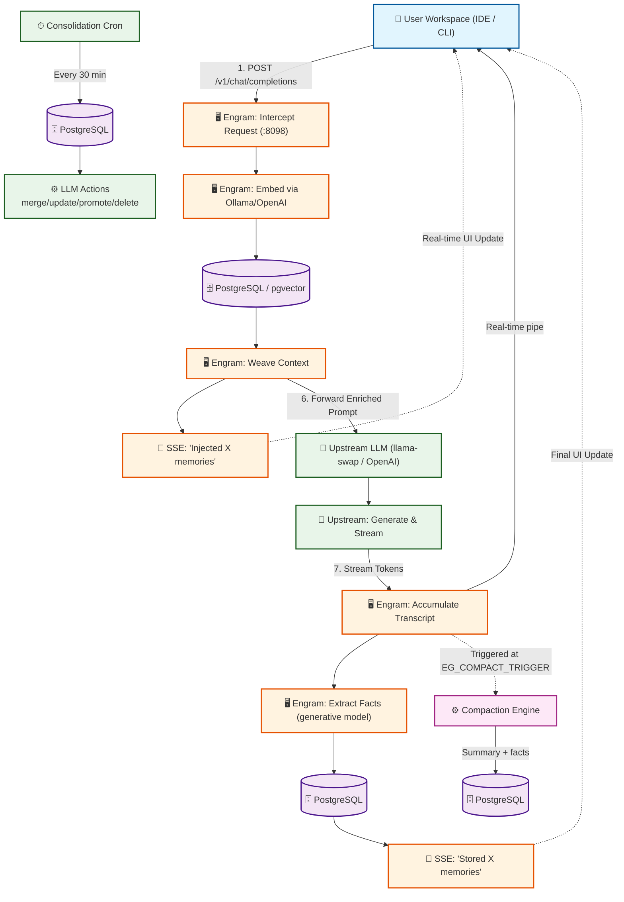

# Agents.md

## Important Files & Directories:
### Files:
- AGENTS.md - Project information, flows, commands, etc
- readme.md - Similar to the agents.md but will have less technical information
- docs/plan.md - The Plan, this is what the project is trying to do accomplish 
- docs/Vision.md - This was a brainstorming session to conceptualize and begin programming the revisions to the project
- docs/model-breakdowns.md - Model selection guide: per-facet embedding routing with cascading fallback chain (per-facet override → provider-wide override → global fallback → hardcoded defaults → universal `bge-m3`)
- docs/compaction.engine.md - Compaction engine design document
- docs/rebrand.md - Rebrand tracking (OpenMemory/CodeCortex → FTR10 Engram)
### Directories:
- packages/engram-js - Engram server (rebranded from OpenMemory/CodeCortex)
- apps/web - Web UI frontend (port 8099 in Docker)
- apps/vscode-extension - VS Code extension ("Engram for VS Code", `@cortex` chat participant)
- apps/langfuse - Langfuse observability platform (tracing, metrics, evals)
- apps/searxNcrawl - Auto-search service (web search via SearXNG MCP server)

## Important Commands:

### Command to Start the server:
  ```bash
  cd packages/engram-js && EG_PORT=8080 npx nodemon src/server.ts
  ```
  
### Docker deployment:
```bash
docker compose up --build -d
```
Docker services: `postgres`, `redis`, `clickhouse`, `minio`, `engram`, `searxncrawl`, `searxng`, `langfuse-web`, `langfuse-worker`.
External ports: **8098** (Engram API), **3000** (Langfuse UI), **8099** (Web GUI).

## Project Flows:


### Compaction Flow:
When conversation exceeds `EG_COMPACT_TRIGGER` messages (code default: **50**, .env.example overrides to **100**), the compaction engine triggers **asynchronously** in the background (non-blocking, cooldown: 10s via `EG_COMPACTION_COOLDOWN_MS`):

1. **Isolate** — Split into old history + a recent raw tail (`EG_MAX_RAW_TURNS`, default: **6**, .env.example overrides to **4**)
2. **Thin** — Truncate tool outputs >800 chars, assistant responses >1200 chars, user messages >1000 chars; remove consecutive duplicate tool calls
3. **Summarize & Extract** — Single LLM call (model: `env.generative_model` from config) produces a dense summary AND durable facts in JSON format
4. **Reconstruct** — Old history replaced with `[COMPACTED SESSION SUMMARY]` plus raw tail; context never grows unbounded

If compaction fails, it drops old history silently and keeps only the raw tail to preserve conversation continuity.

### Consolidation Flow:
Background cron job runs every 30 minutes:
1. **Fetch Groups** — queries memories older than 7 days with `access_count >= 1`, grouped by `consolidation_hash` (min 3 members)
2. **Generate Actions** — sends each group to generative model for structured merge/update/promote/delete decisions
3. **Execute Actions** — applies each action individually against the DB with per-action logging and transaction rollback on failure
4. **Synthesis Fallback** — if LLM omits `new_content` in merge/update actions, falls back to synthesis using fallback model (`env.fallback_model`)

Manual trigger via API: `POST /api/dashboard/consolidate`

### Model Selection Guide:
All models are configurable via env vars with a cascading resolution chain. No hardcoded defaults — the system reads from `.env`.

| Task | Default Model | Config Var(s) | Notes |
|---|---|---|---|
| **Generative (all)** | LFM2.5-1.2B-Instruct | `EG_MODEL_GENERATIVE` + `EG_GENERATIVE_URL` | Primary generative model — MUST be running at all times, thinking DISABLED |
| **Embedding** | nomic-embed-text-v1.5 | `EG_MODEL_EMBEDDING` | Primary embedding; per-facet overrides supported |
| **Embedding (per-facet)** | same as above | `EG_MODEL_EPOCHISODIC`, `EG_MODEL_SEMANTIC`, etc. | Per-sector model override |
| **Fallback** | qwen2.5:3b | `EG_MODEL_GENERATIVE_FALLBACK` | Backup for generative tasks if primary fails |

Per-facet embedding routing uses a cascading resolution chain in `models.ts`: **per-facet override → provider-wide override → global fallback → hardcoded defaults → universal `bge-m3`**.

Supported embedding providers: `openai`, `gemini`, `aws`, `siray`, `local`.

```text
[ USER IDE / CLI ] 
       │
       │ 1. Sends prompt + requested model
       ▼
┌────────────────────────────────────────────────────────────────────────────────┐
│ 🖥️ ENGRAM PROXY (:8098)                                                    │
│                                                                       │
│ 2. Embeds via Ollama/OpenAI (config-driven model)                   │
│ 3. Queries PostgreSQL for Genome/Phenotype memories                 │
│ 4. Weaves memories invisibly into System Prompt                     │
│ 5. ⚡ SSE TO USER: "🧠 Injected X memories"                         │
│                                                                       │
│ 6. Forwards enriched prompt to upstream LLM                          │
│                                                                       │
│ 9. Receives streaming tokens from upstream                           │
│ 10. ⚡ PIPES tokens in real-time to USER                             │
│ 11. Accumulates full response text in background                    │
│                                                                       │
│ 12. Stream ends. Calls generative model for extraction              │
│     (Uses EG_MODEL_GENERATIVE via EG_GENERATIVE_URL)                 │
│ 13. Saves extracted JSON facts to PostgreSQL                        │
│ 14. ⚡ SSE TO USER: "🧠 Stored X memories"                           │
└───────────────────────────────────────────────────────────────────────┘
        ▲                              │
        │ 10. Streams tokens           │ 6. Forwards enriched prompt
        │                              ▼
┌──────────────────────────────────────────────────────────────────────┐
│ 🚀 UPSTREAM LLM (llama-swap / OpenAI / Gemini / Siray)            │
│                                                               │
│ Configured via EG_UPSTREAM_LLM_URL + provider keys              │
│ 7. Receives request & generates response                        │
│ 8. Streams raw SSE tokens back to Engram Proxy                  │
└──────────────────────────────────────────────────────────────────────┘

[COMPACTION ENGINE] (Background, triggered when messages > EG_COMPACT_TRIGGER)
    ├─ 1. ISOLATE: Split old history + recent raw tail
    ├─ 2. THIN: Truncate massive outputs, remove duplicates
    ├─ 3. SUMMARIZE & EXTRACT: Single LLM call (config-driven model)
    └─ 4. RECONSTRUCT: Replace with [COMPACTED SESSION SUMMARY] + raw tail

[CONSOLIDATION ENGINE] (Cron, runs every 30 minutes)
   ├─ 1. FETCH GROUPS: Memories older than 7 days grouped by consolidation_hash
   ├─ 2. GENERATE ACTIONS: Send to LLM for merge/update/promote/delete decisions
   ├─ 3. EXECUTE ACTIONS: Apply each action individually with transaction rollback
   └─ 4. SYNTHESIS FALLBACK: If LLM omits new_content, synthesize from sources

[LANGFUSE OBSERVABILITY] (Docker-only)
   ├─ Traces all generative model calls via Langfuse SDK
   ├─ Tracks compaction and consolidation cycles
   └─ Dashboard at http://localhost:3000
```

## Intended Operation
1. **Start your Backend**: `cd packages/engram-js && EG_PORT=8080 npx nodemon src/server.ts`
   Ensure your Node.js proxy is running & verify it's listening on the configured port (default: 8080).
2. **Open the Chat Panel**: 
   In VS Code, open Kilo's Chat view (`Ctrl+Alt+I` or `Cmd+Option+I`).
3. **Invoke Engram**: 
   Type `@cortex How should I structure my auth middleware?`
4. **Observe the Magic**:
     * You will see "🧠 Querying Engram memory engine..."
     * The response will stream in naturally.
     * At the bottom, you will see a collapsible **"🧠 Engram Memory Trace"** section showing exactly *why* the AI answered the way it did, citing your postgres database.

## Current Status:
- **Rebrand complete**: Renamed from OpenMemory/CodeCortex to FTR10 Engram (packages, env vars, file names)
- **Compaction Engine**: Fully implemented — isolates recent tail, thins history, generates summary + facts via generative model
- **Consolidation Engine**: Background cron job for memory maintenance (merge/update/promote/delete with synthesis fallback)
- **Per-facet embedding routing**: Granular model selection per memory type with cascading fallback chain across 5 providers
- **Langfuse integration**: All generative calls traced via Langfuse SDK; Docker-only observability platform
- **Auto-search**: Web search via searxNcrawl MCP server (configurable, disabled by default)
- **Memory decay engine**: Temporal salience computation with access-based reinforcement and exponential decay
- **Durable memory system**: Genome/Phenotype separation with automatic classification heuristics
- Server is online and operational

## Issues:
### Naming conventions are a bit scattered, in the end the project will be named FTR10 Engram. The server will be named Engram. The modified Kilo extension will be named EngramVS.

