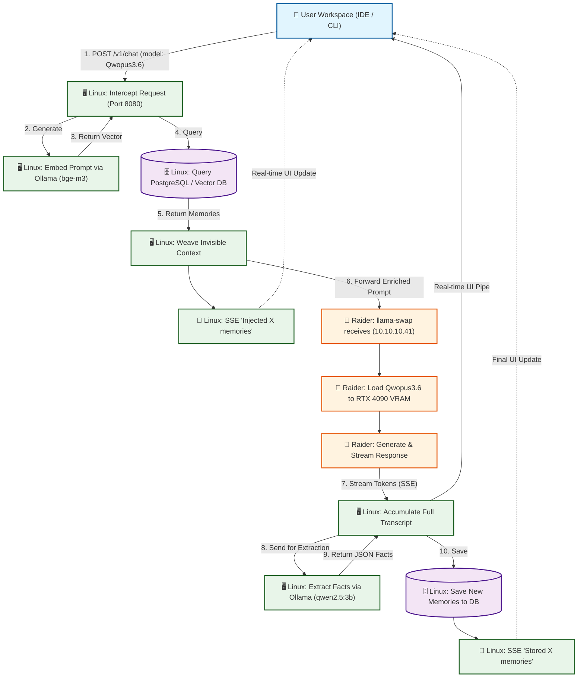

# Agents.md

## Important Files:
- /home/ftr/Documents/openWeb.searxng/OpenMemory/AGENTS.md - Project information, flows, commands, etc
- /home/ftr/Documents/openWeb.searxng/OpenMemory/readme.md - Similar to the agents.md but will have less technical information
- /home/ftr/Documents/openWeb.searxng/OpenMemory - Directory for the entire project
- /home/ftr/Documents/openWeb.searxng/OpenMemory/apps/web - Web Interface
- /home/ftr/Documents/openWeb.searxng/OpenMemory/apps/vscode-extension - Openmemory helper extension, not currently being used
- /home/ftr/Documents/openWeb.searxng/OpenMemory/plan.md - The Plan, this is what the project is trying to do accomplish
- 
- /home/ftr/Documents/openWeb.searxng/OpenMemory/Vision.md - This was a brainstorming session to conceptualize and begin programming the revisions to the project

## Important Commands:

### Command to Start the server:
  ```bash
  cd /home/ftr/Documents/openWeb.searxng/OpenMemory/packages/openmemory-js && OM_PORT=8080 npx nodemon src/server.ts
  ```
## Project Flows:

```text
[ USER IDE / CLI ] 
       │
       │ 1. Sends prompt + requested model ("Qwopus3.6")
       ▼
┌────────────────────────────────────────────────────────────────────────────────┐
│ 🖥️ LINUX SERVER (OpenMemory Proxy :8080)                              │
│                                                                       │
│ 2. Calls Local Ollama (:11434) for embedding (bge-m3)                 │
│ 3. Queries Local DB for Genome/Phenotype memories                     │
│ 4. Weaves memories invisibly into System Prompt                       │
│ 5. ⚡ SENDS SSE TO USER: "🧠 Injected X memories"                    │
│                                                                       │
│ 6. Forwards enriched prompt to MSI Raider (llama-swap :8080)          │
│                                                                       │
│ 9. Receives streaming tokens from MSI Raider                          │
│ 10. ⚡ PIPES tokens in real-time to USER                              │
│ 11. Accumulates full response text in background                      │
│                                                                       │
│ 12. Stream ends. Calls Local Ollama (:11434) for extraction           │
│     (Uses tiny model like qwen2.5:3b to save VRAM)                    │
│ 13. Saves extracted JSON facts to Local DB                            │
│ 14. ⚡ SENDS SSE TO USER: "🧠 Extraction complete. Stored X memories"│
└───────────────────────────────────────────────────────────────────────────────┘
       ▲                              │
       │ 10. Streams tokens           │ 6. Forwards enriched prompt
       │                              ▼
┌──────────────────────────────────────────────────────────────────────┐
│ 🚀 MSI RAIDER (10.10.10.41)                                   │
│                                                               │
│ 7. llama-swap receives request                                │
│ 8. Loads "Qwopus3.6" into RTX 4090 VRAM                       │
│ 9. Generates response (naturally using the baked-in context)  │
└──────────────────────────────────────────────────────────────────────┘
```
```text
[User] 
  ↓ (Types prompt in Kilo, Cline, or Terminal CLI)
[Client Tool] 
  ↓ (Sends POST to http://<Linux-Server-IP>:8080/v1/chat/completions)
[OPENMEMORY PROXY] (Linux Server - The Brain)
  ├─ 1. INTERCEPT: Grabs user prompt & requested model (e.g., Qwopus3.6).
  ├─ 2. INTERNAL RETRIEVE (Local Ollama :11434 & Postgres):
  │     ├─ Embeds prompt using `bge-m3` (Uses CPU, saves Raider VRAM).
  │     ├─ Fetches "Genome" (Immutable facts, zero latency).
  │     └─ Queries "Phenotype" (Vector search across 5 HMD sectors).
  ├─ 3. WEAVE: Silently injects context into the System Prompt.
  ├─ 4. INITIAL STATUS: Sends SSE chunk to client ("🧠 Injected X memories").
  ↓ (Forwards enriched payload to http://10.10.10.41:8080/v1)
[LLAMA-SWAP] (MSI Raider - The Muscle)
  ├─ 5. ROUTE: Receives request & loads `Qwopus3.6` into RTX 4090 VRAM.
  ├─ 6. GENERATE: Creates response (naturally using the baked-in context).
  └─ 7. STREAM: Sends raw SSE tokens back to OpenMemory Proxy.
  ↓ (Tokens arrive back at Linux Server)
[OPENMEMORY PROXY] (Linux Server - The Pipeline)
  ├─ 8. PIPE: Instantly passes raw SSE tokens back to the Client Tool.
  ├─ 9. ACCUMULATE: Silently builds the full transcript in background.
  ├─ 10. EXTRACT (Async - Local Ollama :11434):
  │     ├─ Sends transcript to `qwen2.5:3b` (Tiny model, CPU only).
  │     ├─ Extracts new facts into a strict JSON array.
  │     └─ Saves new memories to local PostgreSQL DB.
  └─ 11. FINAL STATUS: Sends SSE chunk ("🧠 Stored X memories.") & closes stream.
```

## Intended Operation
1. **Start your Backend**: `cd /home/ftr/Documents/openWeb.searxng/OpenMemory/packages/openmemory-js && OM_PORT=8080 npx nodemon src/server.ts`
   Ensure your Node.js proxy is running & Verify it's listening on `http://localhost:8080`.
2. **Open the Chat Panel**: 
   In the new VS Code window, open Kilo's Chat view (`Ctrl+Alt+I` or `Cmd+Option+I`).
3. **Invoke CodeCortex**: 
   Type `@cortex How should I structure my auth middleware?`
4. **Observe the Magic**:
   * You will see "🧠 Querying CodeCortex memory engine..."
   * The response will stream in naturally.
   * At the bottom, you will see a collapsible **"🧠 CodeCortex Memory Trace"** section showing exactly *why* the AI answered the way it did, citing your postgres database.


## Current Status:
- The plan was executed, and is in a debugging phase, CodeCortex is currently online!!

## Issues:
### Naming conventions are a bit scattered, in the end the project will be named FTR10 CodeCortex. The server will be named CodeCortex. The modified Kilo extension will be named CodeCortexVS.

