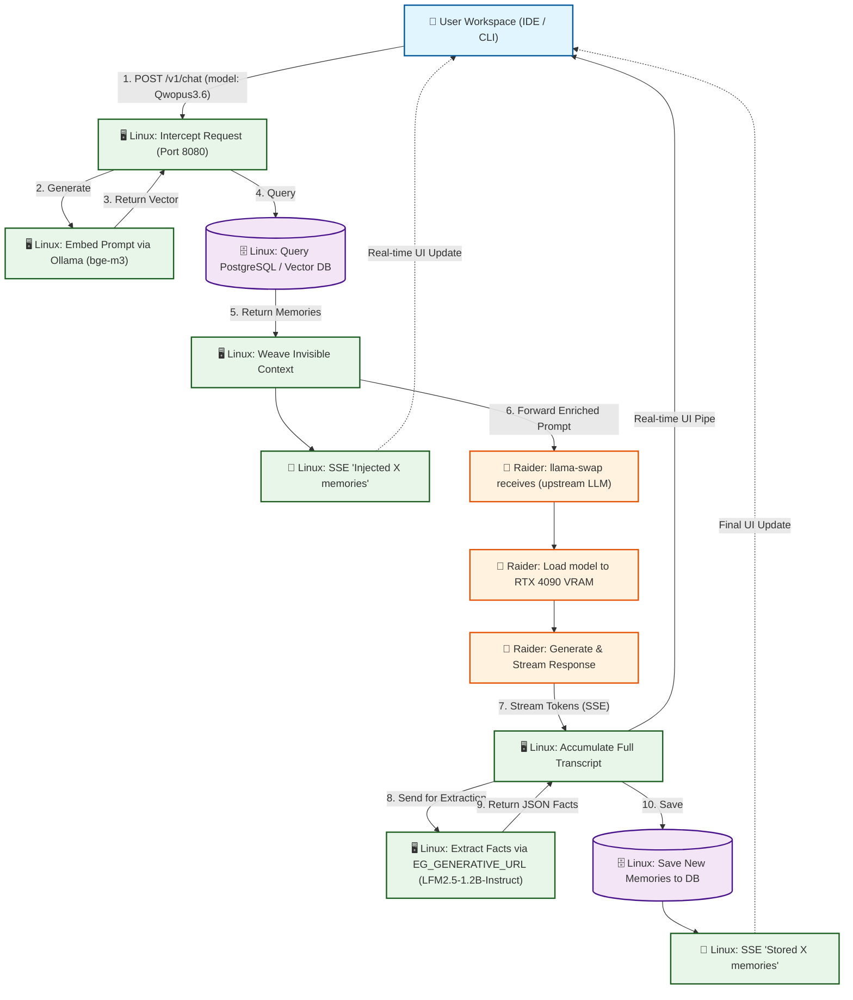

# Agents.md

## Important Files & Directories:
### Files:
- AGENTS.md - Project information, flows, commands, etc
- readme.md - Similar to the agents.md but will have less technical information
- docs/plan.md - The Plan, this is what the project is trying to do accomplish 
- docs/Vision.md - This was a brainstorming session to conceptualize and begin programming the revisions to the project
- docs/model-breakdowns.md - Model selection guide: per-facet embedding routing (qwen3-embedding:0.6b primary, bge-m3 fallback) and generative model choices (LFM2.5-1.2B-Instruct for all generative tasks via EG_GENERATIVE_URL, qwen2.5:3b as fallback)
- docs/compaction.engine.md - Compaction engine design document
- docs/rebrand.md - Rebrand tracking (OpenMemory/CodeCortex → FTR10 Engram)
### Directories:
- packages/engram-js - Engram server (rebranded from OpenMemory/CodeCortex)
- apps/web - Web UI frontend (port 8099 in Docker)
- apps/vscode-extension - VS Code extension ("Engram for VS Code", `@cortex` chat participant)

## Important Commands:

### Command to Start the server:
  ```bash
  cd packages/engram-js && EG_PORT=8080 npx nodemon src/server.ts
  ```
  
### Docker deployment:
```bash
docker-compose up --build
```
Docker auto-pulls models on startup: `LFM2.5-1.2B-Instruct` (generative tasks via EG_GENERATIVE_URL), `qwen2.5:3b` (fallback), `qwen3-embedding:0.6b`, `bge-m3`.
External port: **8098** (internal container port: 8080).

## Project Flows:


### Compaction Flow (new):
When conversation exceeds `EG_COMPACT_TRIGGER` messages (default: 50), the compaction engine triggers **asynchronously** in the background (non-blocking, cooldown: 60s via `EG_COMPACTION_COOLDOWN_MS`):

1. **Select** — takes only the last `EG_COMPACT_MAX_MESSAGES` messages (default: 8) from the tail
2. **Thin** — truncate tool outputs >800 chars, assistant responses >1200 chars, user messages >1000 chars; remove consecutive duplicate tool calls
3. **Summarize & Extract** — single LLM call (model: `EG_MODEL_GENERATIVE`, default: `LFM2.5-1.2B-Instruct` via `EG_GENERATIVE_URL`) generates both a dense summary and durable facts in JSON
4. **Save Facts** — extracted facts tagged with `source: "compaction_engine"` are saved to Phenotype DB via the recursive learning loop

If compaction fails, it logs an error silently (no hard-truncation fallback).

### Consolidation Flow (new):
Background cron job runs every 30 minutes:
1. **Fetch Groups** — queries memories older than 7 days with `access_count >= 1`, grouped by `consolidation_hash` (min 3 members)
2. **Generate Actions** — sends each group to consolidation model (`LFM2.5-1.2B-Instruct` via `EG_GENERATIVE_URL`) for structured merge/update/promote/delete decisions
3. **Execute Actions** — applies each action individually against the DB with per-action logging
4. **Synthesis Fallback** — if LLM forgets `new_content` in merge/update actions, falls back to synthesis model (`qwen2.5:3b`)

### Model Selection Guide:
| Task | Model | Config Var | Why |
|---|---|---|---|
| **Generative (All)** | LFM2.5-1.2B-Instruct | `EG_MODEL_GENERATIVE` | Primary generative model via EG_GENERATIVE_URL — MUST be running at all times, thinking DISABLED |
| **Embedding** | qwen3-embedding:0.6b | `EG_MODEL_EMBEDDING` | Primary embedding; multi-facet with bge-m3 fallback |
| **Embedding (Procedural)** | qwen3-embedding:0.6b | `EG_MODEL_EMBED_PROCEDURAL` | Code-focused embeddings |
| **Embedding (Emotional)** | qwen3-embedding:0.6b | `EG_MODEL_EMBED_EMOTIONAL` | Ultra-lightweight CPU model |
| **Fallback** | qwen2.5:3b | `EG_MODEL_GENERATIVE_FALLBACK` | Backup for generative tasks if primary fails |

Per-facet embedding routing uses a cascading resolution chain in `models.ts`: per-facet override → provider-wide override → global fallback → hardcoded defaults → universal `bge-m3`.

```text
[ USER IDE / CLI ] 
       │
       │ 1. Sends prompt + requested model
       ▼
┌────────────────────────────────────────────────────────────────────────────────┐
│ 🖥️ LINUX SERVER (Engram Proxy :8080)                              │
│                                                                       │
│ 2. Calls Local Ollama (:11434) for embedding (bge-m3)                 │
│ 3. Queries Local DB for Genome/Phenotype memories                     │
│ 4. Weaves memories invisibly into System Prompt                       │
│ 5. ⚡ SENDS SSE TO USER: "🧠 Injected X memories"                    │
│                                                                       │
│ 6. Forwards enriched prompt to upstream LLM                            │
│                                                                       │
│ 9. Receives streaming tokens from MSI Raider                          │
│ 10. ⚡ PIPES tokens in real-time to USER                              │
│ 11. Accumulates full response text in background                      │
│                                                                       │
│ 12. Stream ends. Calls EG_GENERATIVE_URL for extraction               │
     │     (Uses LFM2.5-1.2B-Instruct with think:false for JSON output)    │
│ 13. Saves extracted JSON facts to Local DB                            │
│ 14. ⚡ SENDS SSE TO USER: "🧠 Extraction complete. Stored X memories"│
└───────────────────────────────────────────────────────────────────────────────┘
       ▲                              │
       │ 10. Streams tokens           │ 6. Forwards enriched prompt
       │                              ▼
┌──────────────────────────────────────────────────────────────────────┐
│ 🚀 UPSTREAM LLM (llama-swap / remote GPU server)              │
│                                                               │
│ 7. llama-swap receives request                                │
│ 8. Loads model into RTX 4090 VRAM                             │
│ 9. Generates response (naturally using the baked-in context)  │
└──────────────────────────────────────────────────────────────────────┘
```

```text
[User] 
  ↓ (Types prompt in Kilo, Cline, or Terminal CLI)
[Client Tool] 
  ↓ (Sends POST to http://<Linux-Server-IP>:8080/v1/chat/completions)
[ENGRAM PROXY] (Linux Server - The Brain)
   ├─ 1. INTERCEPT: Grabs user prompt & requested model.
   ├─ 2. INTERNAL RETRIEVE (Local Ollama :11434 & Postgres):
   │     ├─ Embeds prompt using `bge-m3` (Uses CPU, saves Raider VRAM).
   │     ├─ Fetches "Genome" (Immutable facts, zero latency).
   │     └─ Queries "Phenotype" (Vector search across 5 HMD sectors).
   ├─ 3. WEAVE: Silently injects context into the System Prompt.
   ├─ 4. INITIAL STATUS: Sends SSE chunk to client ("🧠 Injected X memories").
   ↓ (Forwards enriched payload)
[UPSTREAM LLM] (llama-swap / remote GPU server)
    ├─ 5. ROUTE: Receives request & loads model into RTX 4090 VRAM.
   ├─ 6. GENERATE: Creates response (naturally using the baked-in context).
   └─ 7. STREAM: Sends raw SSE tokens back to Engram Proxy.
   ↓ (Tokens arrive back at Linux Server)
[ENGRAM PROXY] (Linux Server - The Pipeline)
   ├─ 8. PIPE: Instantly passes raw SSE tokens back to the Client Tool.
   ├─ 9. ACCUMULATE: Silently builds the full transcript in background.
   ├─ 10. EXTRACT (Async - Local Ollama :11434):
    │     ├─ Sends transcript to `LFM2.5-1.2B-Instruct` via EG_GENERATIVE_URL with think:false for JSON output.
   │     ├─ Extracts new facts into a strict JSON array.
   │     └─ Saves new memories to local PostgreSQL DB.
   └─ 11. FINAL STATUS: Sends SSE chunk ("🧠 Stored X memories.") & closes stream.

[COMPACTION ENGINE] (Background, triggered when messages > EG_COMPACT_TRIGGER)
    ├─ 1. SELECT: Takes last EG_COMPACT_MAX_MESSAGES from the tail
    ├─ 2. THIN: Truncate massive outputs, remove duplicates
    ├─ 3. SUMMARIZE & EXTRACT: Single LLM call (qwen3.5:2b)
    └─ 4. SAVE FACTS: Extracted facts → Phenotype DB with source="compaction_engine"

[CONSOLIDATION ENGINE] (Cron, runs every 30 minutes)
   ├─ 1. FETCH GROUPS: Memories older than 7 days grouped by consolidation_hash
   ├─ 2. GENERATE ACTIONS: Send to LLM for merge/update/promote/delete decisions
   ├─ 3. EXECUTE ACTIONS: Apply each action individually against the DB
   └─ 4. SYNTHESIS FALLBACK: If LLM forgets new_content, synthesize from sources
```

## Intended Operation
1. **Start your Backend**: `cd packages/engram-js && EG_PORT=8080 npx nodemon src/server.ts`
   Ensure your Node.js proxy is running & Verify it's listening on `http://localhost:8080`.
2. **Open the Chat Panel**: 
   In the new VS Code window, open Kilo's Chat view (`Ctrl+Alt+I` or `Cmd+Option+I`).
3. **Invoke Engram**: 
   Type `@cortex How should I structure my auth middleware?`
4. **Observe the Magic**:
    * You will see "🧠 Querying Engram memory engine..."
    * The response will stream in naturally.
    * At the bottom, you will see a collapsible **"🧠 Engram Memory Trace"** section showing exactly *why* the AI answered the way it did, citing your postgres database.

## Current Status:
- **Rebrand complete**: Renamed from OpenMemory/CodeCortex to FTR10 Engram (packages, env vars, file names)
- **Compaction Engine**: Fully implemented — handles long conversations with summary + fact extraction
- **Consolidation Engine**: Background cron job for memory maintenance (merge/update/promote/delete)
- **Model updates**: All generative tasks unified to `qwen3.5:2b`, fallback → `qwen2.5:3b`
- **Per-facet embedding routing**: Granular model selection per memory type with cascading fallback chain
- Server is online and operational

## Issues:
### Naming conventions are a bit scattered, in the end the project will be named FTR10 Engram. The server will be named Engram. The modified Kilo extension will be named EngramVS.
