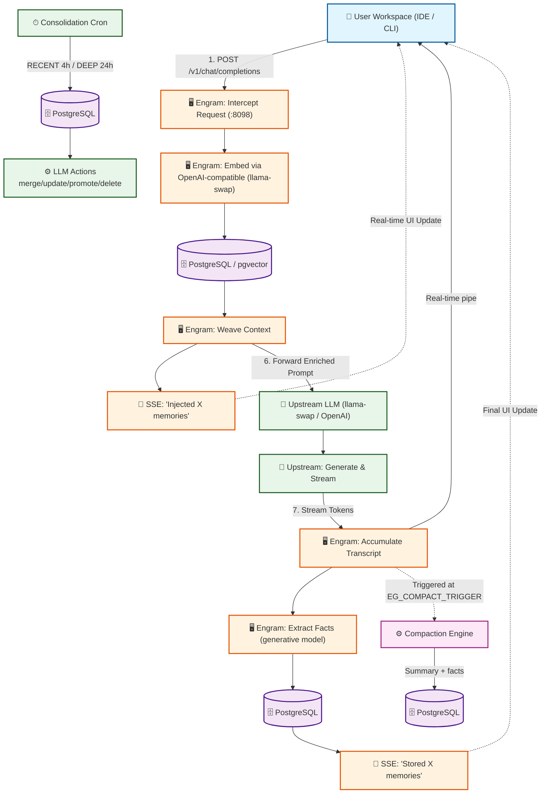

# Agents.md

## Important Files & Directories:
### Files:
- AGENTS.md - Project information, flows, commands, etc
- readme.md - Similar to the agents.md but will have less technical information
- docs/model-config-audit.md - **Configuration reference**: full audit of every model variable + the Settings-tab registry design
- docs/model-breakdowns.md - Model selection guide (current: Settings-tab registry, no hardcoded defaults)
- docs/trace-observability-plan.md - Trace store + judge scoring design (implemented v4.2.0)
- docs/governance-plan.md - Judge calibration/consistency/policy/review design (implemented v4.3.0)
- docs/memory-integrity-plan.md - Integrity engine (auto-heal) design (implemented v4.4.0)
- docs/optimization-plan.md - Enrichment engine (auto-optimization) design + contamination incident post-mortem (implemented v4.5.0)
- docs/coherence-plan.md - Memory coherence design (context frames, linked clusters, sourced bundles — implemented v4.6.0)
- docs/changelog-2026-08-04-05.md - Recent build changelog
- docs/todo.md - Implementation plans (kept as historical reference)
- docs/archive/ - Superseded design/plan documents (Langfuse plans, original plan.md, rebrand notes, etc.)
### Directories:
- packages/engram-js - Engram server (rebranded from OpenMemory/CodeCortex)
- apps/web - Web UI frontend (port 8099 in Docker)
- apps/vscode-extension - VS Code extension ("Engram for VS Code", `@cortex` chat participant)
- apps/searxNcrawl - Auto-search service (web search via SearXNG MCP server)
- apps/langfuse - Langfuse code still on disk but REMOVED from docker-compose (observability disabled — treat as dead)

## Important Commands:

### Command to Start the server:
  ```bash
  cd packages/engram-js && EG_PORT=8080 HOST=0.0.0.0 npx tsx src/server.ts
  ```
  
### Docker deployment:
```bash
docker compose up --build -d
```
Docker services: `postgres`, `redis`, `engram`, `searxncrawl`, `searxng`, `web`.
External ports: **8098** (Engram API), **8099** (Web GUI), 5432 (Postgres), 6379 (Redis).

### Manual engine triggers (dashboard API, port 8098):
```bash
curl -X POST http://localhost:8098/api/dashboard/consolidate            # consolidation (both tiers)
curl -X POST http://localhost:8098/api/dashboard/integrity/run          # integrity engine now
curl -X POST http://localhost:8098/api/dashboard/enrichment/run         # enrichment engine now
curl -X POST http://localhost:8098/api/dashboard/traces/report          # trace report (aggregates + suggestions)
curl -X POST http://localhost:8098/api/dashboard/judge/run-calibration  # judge vs human labels (agreement %)
curl -X POST http://localhost:8098/api/dashboard/judge/consistency      # judge stability (N×R variance)
curl -X POST http://localhost:8098/api/dashboard/memory-audit/<id>/undo # undo a mutation (supersede/delete/update/enrich)
curl -X POST "http://localhost:8098/api/dashboard/coherence/link-backfill" # one-time legacy link backfill (idempotent, SQL-only)
curl -X POST "http://localhost:8098/api/memories/bundle?topic=<topic>"      # composed, source-anchored knowledge bundle
```

## Project Flows:

```mermaid
flowchart TD
    classDef user fill:#e1f5fe,stroke:#01579b,stroke-width:2px
    classDef engram fill:#fff3e0,stroke:#e65100,stroke-width:2px
    classDef upstream fill:#e8f5e9,stroke:#1b5e20,stroke-width:2px
    classDef db fill:#f3e5f5,stroke:#4a148c,stroke-width:2px
    classDef infra fill:#f0f0f0,stroke:#666,stroke-width:1px

    U["👤 User Workspace (IDE / CLI)"]:::user

    E1["🖥️ Engram: Intercept Request (:8098)"]:::engram
    E2["🖥️ Engram: Embed via OpenAI-compatible (llama-swap)"]:::engram
    E3[("🗄️ PostgreSQL / pgvector")]:::db
    E4["🖥️ Engram: Weave Context"]:::engram
    E5["📡 SSE: 'Injected X memories'"]:::engram

    UP1["🚀 Upstream LLM (llama-swap / OpenAI)"]:::upstream
    UP2["🚀 Upstream: Generate & Stream"]:::upstream

    E6["🖥️ Engram: Accumulate Transcript"]:::engram
    E7["🖥️ Engram: Extract Facts (generative model)"]:::engram
    E8[("🗄️ PostgreSQL")]:::db
    E9["📡 SSE: 'Stored X memories'"]:::engram

    U -->|"1. POST /v1/chat/completions"| E1
    E1 --> E2
    E2 --> E3
    E3 --> E4
    E4 --> E5
    E5 -.->|"Real-time UI Update"| U
    E4 -->|"6. Forward Enriched Prompt"| UP1
    UP1 --> UP2
    UP2 -->|"7. Stream Tokens"| E6
    E6 -->|"Real-time pipe"| U
    E6 --> E7
    E7 --> E8
    E8 --> E9
    E9 -.->|"Final UI Update"| U

    classDef compaction fill:#fde8f7,stroke:#a12483,stroke-width:2px
    C1["⚙️ Compaction Engine"]:::compaction
    C2[("🗄️ PostgreSQL")]:::db
    E6 -.->|"Triggered at EG_COMPACT_TRIGGER"| C1
    C1 -->|"Summary + facts"| C2

    classDef consolidation fill:#e8f5e9,stroke:#1b5e20,stroke-width:2px
    S1["⏱ Consolidation Cron"]:::consolidation
    S2[("🗄️ PostgreSQL")]:::db
    S3["⚙️ LLM Actions\nmerge/update/promote/delete"]:::consolidation
    S1 -->|"RECENT 4h / DEEP 24h"| S2
    S2 --> S3
```

### Compaction Flow:
When conversation exceeds `EG_COMPACT_TRIGGER` messages (code default: **50**, .env.example overrides to **100**), the compaction engine triggers **asynchronously** in the background (non-blocking, cooldown: 10s via `EG_COMPACTION_COOLDOWN_MS`):

1. **Isolate** — Split into old history + a recent raw tail (`EG_MAX_RAW_TURNS`, default: **6**, .env.example overrides to **4**)
2. **Thin** — Truncate tool outputs >800 chars, assistant responses >1200 chars, user messages >1000 chars; remove consecutive duplicate tool calls
3. **Summarize & Extract** — Single LLM call (model: `env.generative_model` from config) produces a dense summary AND durable facts in JSON format
4. **Reconstruct** — Old history replaced with `[COMPACTED SESSION SUMMARY]` plus raw tail; context never grows unbounded

If compaction fails, it drops old history silently and keeps only the raw tail to preserve conversation continuity.

### Consolidation Flow:
Two-tier background cron (intervals/windows/min-groups overridable via `EG_CONSOLIDATION_*` or the GUI Settings tab):
1. **RECENT tier** — every 4h, scans the last 7 days (min-group 2, access ≥ 0): promotes standing rules / merges near-dupes promptly.
2. **DEEP tier** — every 24h, scans memories 7–30 days old (min-group 3, access ≥ 1): long-window cleanup.
3. **Fetch Groups** — grouped by `consolidation_hash` (note: hashes are never written today, so the whole store behaves as one group).
4. **Chunk** — groups are split into ≤150 memories per LLM call (`EG_CONSOLIDATION_BATCH_MEMORIES`) so prompts fit the model context.
5. **Generate Actions** — LLM returns merge/update/promote/delete decisions as JSON (`response_format: json_object` + tolerant parsing); model resolved via the settings registry.
6. **Execute Actions** — applied per-action against the DB with transaction rollback on failure.

Manual trigger via API: `POST /api/dashboard/consolidate` (`?tier=recent` / `?tier=deep` / both by default)

### Model Selection Guide:
Models/providers are configured in the **web GUI Settings tab** (persisted in Postgres `app_settings`) — it is the single source of truth. Resolution (see `src/database/modelRegistry.ts`): **Settings → env override → fail with a clear message**. There are NO hardcoded model-name defaults anywhere in the codebase. The **Judge** section is a fully independent model/provider for trace scoring (deliberately not tied to the generative chain; `EG_JUDGE_MODEL` / `EG_JUDGE_URL` / `EG_JUDGE_API_KEY` fallbacks).

| Task | Deployed model | Notes |
|---|---|---|
| **Generative** (extraction, compaction, consolidation, autoSearch) | Gemma-4-12B-no-thinking | Master model in Settings → Generative; per-task overrides available (extraction/compaction/consolidation) |
| **Judge** (trace scoring, false-memory sampling, enrichment rubrics) | Qwen3.6-28B-REAP20 | Settings → Judge — deliberately a **second, fully independent model** from the generative chain; own provider URL possible |
| **Embedding** | nomic-embed-text-v1.5 (768-dim) | Master model in Settings → Embedding; per-facet overrides for episodic/semantic/procedural/emotional/reflective |
| **Provider** | llama-swap @ http://10.10.10.41:8080/v1 | Set in Settings → Provider (type OpenAI Compatible, host IP, port) |

Legacy env overrides still honored as fallback: `EG_MODEL_GENERATIVE`, `EG_MODEL_EMBEDDING`, `EG_MODEL_EMBED_<FACET>`, `EG_CONSOLIDATION_MODEL` — but they are no longer required.

Supported embedding providers: `openai`, `gemini`, `aws`, `siray`, `local`.

```text
[ USER IDE / CLI ] 
       │
       │ 1. Sends prompt + requested model
       ▼
┌────────────────────────────────────────────────────────────────────────────────┐
│ 🖥️ ENGRAM PROXY (:8098)                                                    │
│                                                                       │
│ 2. Embeds via OpenAI-compatible provider (Settings tab)           │
│ 3. Queries PostgreSQL for Genome/Phenotype memories                 │
│ 4. Weaves memories invisibly into System Prompt                     │
│ 5. ⚡ SSE TO USER: "🧠 Injected X memories"                         │
│                                                                       │
│ 6. Forwards enriched prompt to upstream LLM                          │
│                                                                       │
│ 9. Receives streaming tokens from upstream                           │
│ 10. ⚡ PIPES tokens in real-time to USER                             │
│ 11. Accumulates full response text in background                    │
│                                                                       │
│ 12. Stream ends. Calls generative model for extraction              │
│     (resolved via Settings registry)                                 │
│ 13. Saves extracted JSON facts to PostgreSQL                        │
│ 14. ⚡ SSE TO USER: "🧠 Stored X memories"                           │
└───────────────────────────────────────────────────────────────────────┘
        ▲                              │
        │ 10. Streams tokens           │ 6. Forwards enriched prompt
        │                              ▼
┌──────────────────────────────────────────────────────────────────────┐
│ 🚀 UPSTREAM LLM (llama-swap / OpenAI / Gemini / Siray)            │
│                                                               │
│ Configured via EG_UPSTREAM_LLM_URL + provider keys              │
│ 7. Receives request & generates response                        │
│ 8. Streams raw SSE tokens back to Engram Proxy                  │
└──────────────────────────────────────────────────────────────────────┘

[COMPACTION ENGINE] (Background, triggered when messages > EG_COMPACT_TRIGGER)
    ├─ 1. ISOLATE: Split old history + recent raw tail
    ├─ 2. THIN: Truncate massive outputs, remove duplicates
    ├─ 3. SUMMARIZE & EXTRACT: Single LLM call (config-driven model)
    └─ 4. RECONSTRUCT: Replace with [COMPACTED SESSION SUMMARY] + raw tail

[CONSOLIDATION ENGINE] (Two-tier cron: RECENT 4h / last 7d, DEEP 24h / 7–30d)
   ├─ 1. FETCH GROUPS: memories in tier window, grouped by consolidation_hash
   ├─ 2. CHUNK: ≤150 memories per LLM call
   ├─ 3. GENERATE ACTIONS: LLM JSON merge/update/promote/delete decisions
   ├─ 4. EXECUTE ACTIONS: per-action with transaction rollback
   └─ 5. SYNTHESIS FALLBACK: if LLM omits new_content, synthesize from sources

[TRACE + JUDGE] (every request → persistent traces, auto-scored)
   ├─ 1. CAPTURE: route/status/ms/bodies (secrets redacted, `EG_TRACE_MAX_BODY_CHARS` cap)
   ├─ 2. AUTO-SCORE: chat→answer_quality, ingest→extraction_fidelity, recall→recall_relevance
   ├─ 3. GOVERN: calibration set (human labels) + consistency (N×R variance) + policy thresholds
   └─ 4. REVIEW: low-scored traces flagged needs-review until opened; report + PDF export

[INTEGRITY ENGINE] (auto-heal cron, `EG_INTEGRITY_INTERVAL_MS`, default 24h — run locks)
   ├─ 1. TIER-1 deterministic: 8 checks (dupes, empty, null/synthetic embeddings, sectors, near-dupes, secrets)
   ├─ 2. TIER-2 judged: sample oldest never-accessed (skip open findings) → is-it-a-fact rubric
   ├─ 3. ACT per `EG_INTEGRITY_TIER2_ACTION`: flag (default) | supersede | delete (gated on calibration + confidence)
   └─ 4. FINDINGS LEDGER: verdicts + Apply/Dismiss in Memory Audit tab (all mutations audited + undoable)

[ENRICHMENT ENGINE] (optimization cron, `EG_ENRICHMENT_INTERVAL_MS`, default 24h — run locks)
   ├─ 1. SELECT: used-most × completeness rubric; NEVER genome (column OR metadata) / intent / TODO
   ├─ 2. SOURCES: store (≥0.85 sim) → codebase (rg over allowlisted roots, file:line) → web (searxNcrawl)
   ├─ 3. GROUND: judge gate drops cross-project sources; compose (verbatim + [src:N]) + validate (≥0.6)
   └─ 4. MUTATE: `enrichMemory` → sourced successor + supersede (ONE audit row, one undo click); `EG_ENRICHMENT_ACTION` default flag

[AUDIT + UNDO] (every mutation → audit_log with before/after full rows incl. embedding)
   └─ Memory Audit tab: undo supersede/delete/update/reclassify/enrich; REVERTED badges on reverted findings

[COHERENCE ENGINE] (rung 4 — context frames + linked clusters + sourced bundles)
   ├─ 1. EXTRACT: {context, facts[], links[]} — context frame (project/module/file/topic) on
   │        every fact; SPECIFICS-OR-NOTHING (hard); links part_of/derives_from/related_to
   ├─ 2. WRITE: metadata.context persisted; links → edges (same batch); unsupported link
   │        types → cluster_link_evaluation finding (memories never dropped for being unlinked)
   ├─ 3. BUNDLE: /api/memories/bundle?topic=X — anchor (top recall) → BFS edges → sim ≥ 0.75
   │        neighbors → compose (architecture→state→conventions→pitfalls, [src:N] anchored)
   │        → validate (≥0.6, no cross-project drift) → injected into /api/cognitive-context
   │        on "working on X" detection (read-only, 5-min TTL)
   └─ 4. HYGIENE: integrity check #9 broken_links (edges → superseded memories flagged)
```

## Intended Operation
1. **Start your Backend**: `cd packages/engram-js && EG_PORT=8080 HOST=0.0.0.0 npx tsx src/server.ts`
   Ensure your Node.js proxy is running & verify it's listening on the configured port (default: 8080).
2. **Open the Chat Panel**: 
   In VS Code, open Kilo's Chat view (`Ctrl+Alt+I` or `Cmd+Option+I`).
3. **Invoke Engram**: 
   Type `@cortex How should I structure my auth middleware?`
4. **Observe the Magic**:
     * You will see "🧠 Querying Engram memory engine..."
     * The response will stream in naturally.
     * At the bottom, you will see a collapsible **"🧠 Engram Memory Trace"** section showing exactly *why* the AI answered the way it did, citing your postgres database.

## Current Status:
- **Rebrand complete**: Renamed from OpenMemory/CodeCortex to FTR10 Engram (packages, env vars, file names)
- **Compaction Engine**: Fully implemented — isolates recent tail, thins history, generates summary + facts via generative model
- **Consolidation Engine**: Background cron job for memory maintenance (merge/update/promote/delete with synthesis fallback)
- **Settings tab (single source of truth)**: providers, generative/embedding/judge models, general tuning, and read-only advanced values — persisted in Postgres `app_settings` (schema `4.4.0-integrity`), no hardcoded model defaults
- **Trace store (v4.2.0-traces)**: every request captured with full bodies (secrets regex-redacted), genome/phenotype breakdown, LLM-judge scores — Traces tab (`/api/dashboard/traces*`), retention-pruned
- **Judge governance (v4.3.0-governance)**: calibration set + run-calibration (agreement %), consistency check (N×R variance), live policy thresholds (0.7/0.4), needs-review loop — Governance tab
- **Integrity engine (v4.4.0-integrity)**: 9 deterministic checks (incl. broken_links from v4.6.0) + judged false-memory sampling, flag-first Tier-2, automatic calibration gate (flashing red banner when closed) — Memory Audit tab
- **Enrichment engine (v4.5.0-optimization)**: used-most × completeness → sourced successors (store/codebase/web), genome+intent guardrails, grounding gate, **flag-first default** after the 2026-08-07 contamination incident
- **Coherence (v4.6.0-coherence)**: extraction context frames + specifics-or-nothing + linked clusters (edges); bundle composer ("the living skill") at `/api/memories/bundle` + `/api/cognitive-context` topic detection; integrity check #9 broken_links
- **Audit trail + undo**: every mutation writes audit_log (before/after full rows); supersede/delete/update/enrich one-click undoable; REVERTED markers on reverted findings
- **Model registry**: `modelRegistry.ts` resolves every model via Settings → env → fail (incl. the independent Judge model)
- **Auto-search**: Web search via searxNcrawl MCP server (configurable, disabled by default)
- **Memory decay engine**: Temporal salience computation with access-based reinforcement and exponential decay
- **Durable memory system**: Genome/Phenotype separation with automatic classification heuristics
- Server is online and operational

## Issues:
### Naming conventions are a bit scattered, in the end the project will be named FTR10 Engram. The server will be named Engram. The modified Kilo extension will be named EngramVS.

