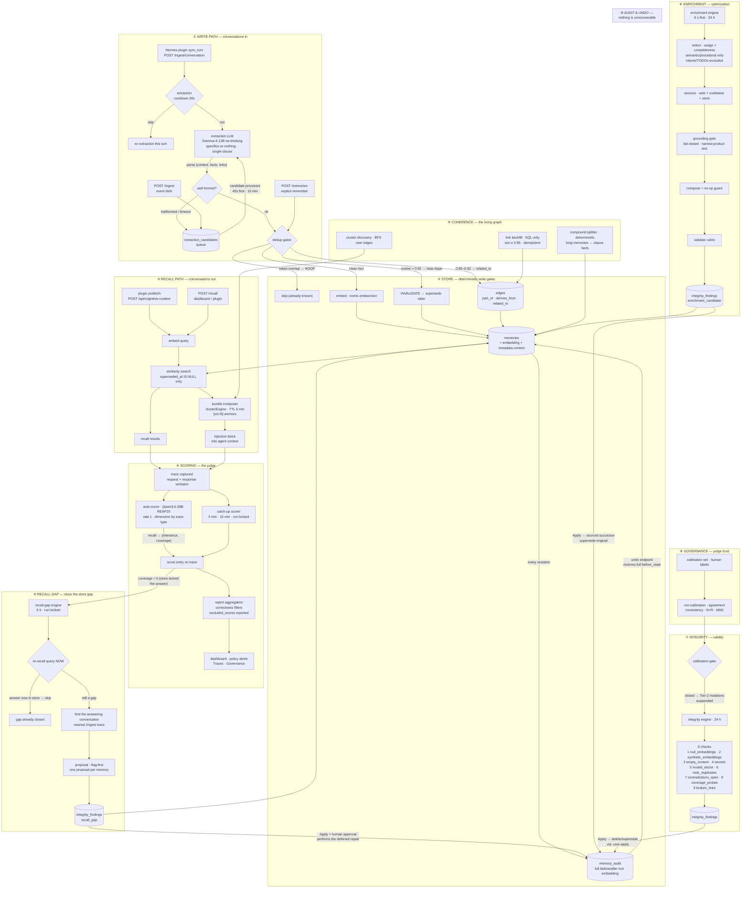
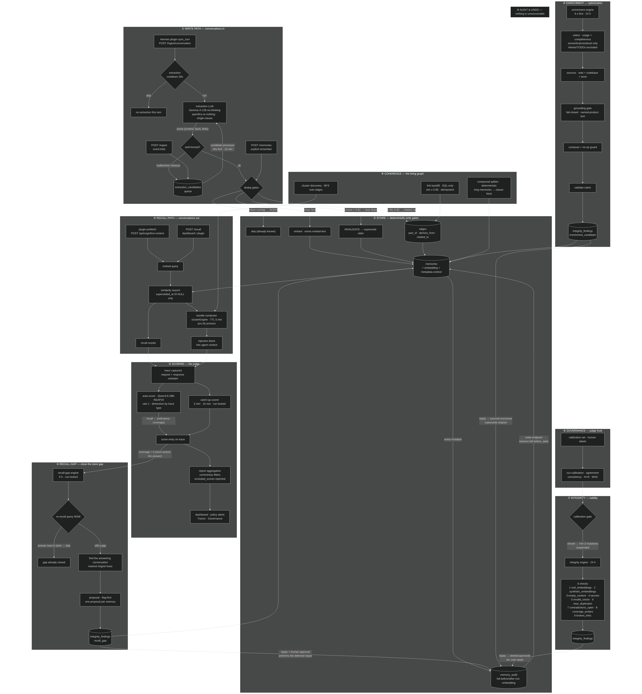

# Memory Flow — How Memories Move Through Engram

> **Status:** Living document — matches the live build (v4.7.x).
> Every pipeline below is real code. The Mermaid flowchart renders natively on GitHub; the standalone HTML is a dark-themed view of the same flow.

## The flow at a glance

## The eleven gates a fact must pass to reach the store

| #   | Gate                                                         | Where                   | Failure behavior                                      |
| --- | ------------------------------------------------------------ | ----------------------- | ----------------------------------------------------- |
| 1   | Extraction cooldown (30s)                                    | `memoryLogger`          | No extraction this turn                               |
| 2   | Extraction quality bar (specifics-or-nothing, single-clause) | extraction prompt       | Fact rejected at the source                           |
| 3   | Well-formedness (parse)                                      | `memoryLogger`          | Body → `extraction_candidates` → drained by processor |
| 4   | Token-overlap dedupe                                         | `rememberDurableMemory` | NOOP (already known)                                  |
| 5   | Near-dupe cosine > 0.92                                      | write path              | INVALIDATE → supersede older                          |
| 6   | Similarity 0.85–0.92                                         | write path / backfill   | `related_to` edge, memory kept                        |
| 7   | Sector validation                                            | write path              | Genome/episodic/emotional not auto-written            |
| 8   | Embedding (nomic)                                            | write path              | Store with vector                                     |
| 9   | Context frame + links                                        | coherence               | `metadata.context` + edges                            |
| 10  | Audit row                                                    | every mutation          | `memory_audit` before/after                           |
| 11  | Recall visibility (`superseded_at IS NULL`)                  | search                  | Superseded memories never recalled                    |

## Engines — schedule & posture

| Engine              | Schedule                    | Posture                                    | Key output                             |
| ------------------- | --------------------------- | ------------------------------------------ | -------------------------------------- |
| Enrichment          | 6s first tick, 24h          | **flag-first**                             | `enrichment_candidate` findings        |
| Integrity           | 24h (run-locked)            | mixed: auto-repair + **flag-first** Tier-2 | 9 checks → findings                    |
| Recall-gap          | 60s first tick, 6h          | **flag-first**                             | `recall_gap` findings (one per memory) |
| Candidate processor | 45s, 15min                  | auto                                       | drained extraction queue               |
| Catch-up scorer     | 5min, 15min                 | auto                                       | retried judge scores                   |
| Consolidation       | 2s first tick, 4h/24h tiers | auto                                       | merged memory rows                     |
| Compound splitter   | manual trigger              | audited supersede                          | clause-fact split                      |

## The self-healing loop (one paragraph)

A question the store can't answer produces a low-coverage recall → the judge records `coverage: 0` → the recall-gap engine proposes enriching the underperforming memory with the conversation's own answer → Apply creates a sourced successor (audited, undoable) → the next recall of that question finds the answer. The integrity engine runs the same loop for validity (noise, secrets, near-dupes, broken links) and the compound splitter fixes the one remaining structural weakness (facts buried in long memories get diluted to a single embedding vector). Everything that mutates memory writes a full before/after audit row, so every step of every loop is undoable.

## Rendered preview

> The standalone view: [memory-flow.html](memory-flow.html) (dark-themed, self-contained SVG — open in any browser). Regenerate with `npx -y mmdc -i memory-flow.mmd -o memory-flow.svg --theme dark` (labels render as HTML `<foreignObject>` — a real browser or chromium is required; `rsvg-convert` drops them).
