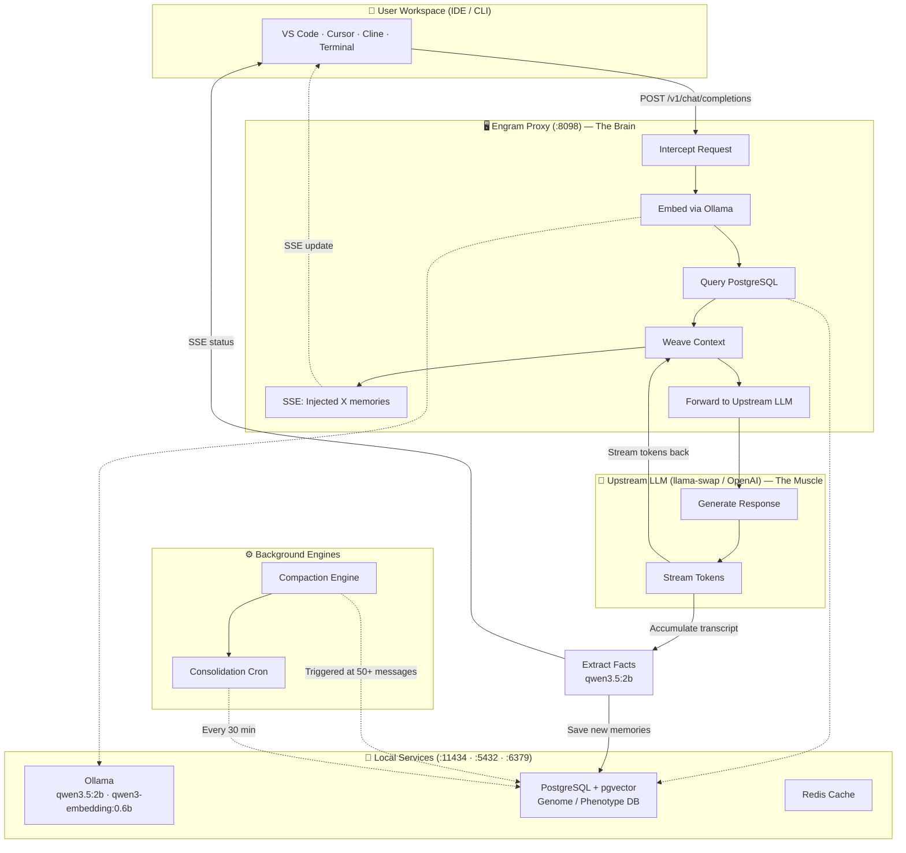

# Engram — Persistent Memory for AI Agents

A cognitive memory proxy that gives LLMs **persistent, project-aware context** across sessions. Intercept API calls, embed queries locally, recall relevant memories from a PostgreSQL vector store, silently inject them into the system prompt, and automatically extract new facts from conversations for future recall.

> 🧠 *Your AI assistant remembers everything — without bloating context windows.*

[]()
[]()
[](https://www.postgresql.org/)
[](https://ollama.com/)
[]()

---

## Table of Contents

- [Architecture](#architecture)
- [How It Works](#how-it-works)
- [Memory Model](#memory-model-genome--phenotype)
- [Compaction Engine](#compaction-engine)
- [Consolidation Engine](#consolidation-engine-the-hippocampus)
- [Quick Start (Docker)](#quick-start-docker)
- [Client Configuration](#client-configuration)
- [Configuration](#configuration)
- [Local Development](#local-development-no-docker)
- [Web GUI](#web-gui)
- [API Overview](#api-overview)
- [Troubleshooting](#troubleshooting)

---

## Architecture



---

## How It Works

1. **Intercept** — User sends a prompt to `http://<server>:8098/v1/chat/completions` (OpenAI-compatible endpoint)
2. **Embed & Recall** — Engram uses local Ollama (`qwen3-embedding:0.6b`) to embed the query, then searches PostgreSQL for relevant memories across 5 sectors
3. **Weave Context** — Relevant memories are silently injected into the system prompt with instructions to use them naturally in responses
4. **Forward** — The enriched request is forwarded to an upstream LLM (llama-swap, OpenAI, Gemini, etc.) for generation
5. **Stream** — Tokens stream back transparently to the client in real-time via SSE
6. **Extract** — After the response completes, `qwen3.5:2b` extracts new facts from the conversation and saves them to PostgreSQL
7. **Compact** — When a conversation exceeds 50 messages (configurable), old history is summarized and thinned so context windows never grow unbounded
8. **Notify** — SSE status messages inform the user of injected memories and stored facts

---

## Memory Model: Genome & Phenotype

Engram uses a biologically-inspired memory architecture with two distinct layers:

| Layer | Behavior | Description |
|-------|----------|-------------|
| 🧬 **Genome** | Immutable, never decays | Foundational facts that are always injected (e.g., *"User prefers functional React components"*) |
| 🔬 **Phenotype** | Decaying context via vector search | Context retrieved by similarity across 5 sectors: |

### Phenotype Sectors

| Sector | Type | Example |
|--------|------|---------|
| 📖 `semantic` | Facts & domain knowledge | *"PostgreSQL uses pgvector for embeddings"* |
| ⚙️ `procedural` | Code patterns & workflows | *"Auth middleware validates JWT tokens before route handlers"* |
| 🎬 `episodic` | Events & specific interactions | *"User debugged the Docker compose setup on March 15"* |
| 💭 `emotional` | Preferences, tone, sentiment | *"User prefers concise, no-nonsense explanations"* |
| 🔍 `reflective` | Meta-cognition & lessons learned | *"When debugging Docker networking, always check subnet conflicts first"* |

---

## Compaction Engine

When a conversation exceeds the message threshold (default: **50**), the compaction engine runs in the background to keep context windows bounded:

1. **Isolate** — Split into old history + a recent raw tail (`EG_MAX_RAW_TURNS`, default: 6)
2. **Thin** — Truncate oversized tool outputs (>800 chars), assistant responses (>1200 chars), and user messages (>1000 chars); remove consecutive duplicate tool calls
3. **Summarize & Extract** — One LLM call (`qwen3.5:2b`) produces a dense summary AND durable facts in JSON format
4. **Save Facts** — Extracted facts are tagged with `source: "compaction_engine"` and saved to the Phenotype DB via the recursive learning loop
5. **Reconstruct** — The old history is replaced with `[COMPACTED SESSION SUMMARY]` plus the raw tail, so context never grows

> If compaction fails for any reason, a hard-truncation fallback drops old history entirely and inserts an error note to preserve conversation continuity.

---

## Consolidation Engine (The Hippocampus)

A background cron job that runs every **30 minutes** to maintain knowledge base health — merging related memories, promoting important ones, and pruning obsolete facts:

1. **Fetch Groups** — Queries memories older than 7 days with `access_count >= 1`, grouped by `consolidation_hash` (minimum 3 members per group)
2. **Generate Actions** — Sends each group to the LLM (`qwen3.5:2b`) which decides whether to **merge**, **update**, **promote to genome**, or **delete** memories
3. **Execute Actions** — Applies each action individually against the DB with per-action logging for full auditability
4. **Synthesis Fallback** — If the LLM forgets to provide `new_content` during merge/update, a synthesis model (`qwen2.5:3b`) generates it automatically

Manual trigger via API: `POST /api/dashboard/consolidate`

---

## Quick Start (Docker)

The fastest way to get Engram running is with Docker Compose — it pulls all models and starts every service in one command.

```bash
# Pull models, build, and start everything
docker compose up --build -d

# Check status
docker compose ps

# View logs
docker compose logs -f engram
```

### Services

| Service | Port | Description |
|---------|------|-------------|
| **postgres** | 5432 | PostgreSQL with pgvector — memory storage |
| **redis** | 6379 | Redis cache / valkey storage |
| **ollama** | 11434 | Ollama LLM server (auto-pulls models on startup) |
| **engram** | 8098 | Engram proxy — the main API endpoint |
| **ui** | 8099 | Web GUI dashboard |

### Auto-Pulled Models

On container start, a model-loader service automatically pulls:

| Model | Purpose |
|---|---|
| `qwen3.5:2b` | Primary generative — extraction, compaction, consolidation |
| `qwen2.5:3b` | Generative fallback (stays offline unless primary fails) |
| `qwen3-embedding:0.6b` | Primary embedding model (all facets) |
| `bge-m3` | Embedding fallback (stays offline unless primary fails) |

> **Note:** Only `qwen3.5:2b` and `qwen3-embedding:0.6b` need to be running at all times. The fallback models are downloaded but normally stay idle until needed.

### Stop & Clean

```bash
# Stop all services
docker compose down

# Stop and remove all data volumes (fresh start)
docker compose down -v
```

---

## Client Configuration

Point your IDE or CLI tool to the Engram proxy:

```
http://<your-server-ip>:8098/v1
```

The proxy forwards enriched requests to the upstream LLM configured via `EG_UPSTREAM_LLM_URL` (default: `http://100.108.182.121:8080/v1`). Engram supports OpenAI, Gemini, and Siray as fallback upstream providers — just set the corresponding API key and base URL in `.env`.

---

## Configuration

Copy `.env.example` to `.env` and adjust as needed. Here are the most important variables:

| Variable | Default | Description |
|----------|---------|-------------|
| `EG_PORT` | `8080` | Server HTTP port (internal container) |
| `EG_STORAGE` | `postgres` | Storage backend (`postgres`, `sqlite`) |
| `EG_OLLAMA_URL` | `http://localhost:11434` | Ollama endpoint for embeddings & generative tasks |
| `EG_UPSTREAM_LLM_URL` | `http://100.108.182.121:8080/v1` | Upstream LLM forwarding endpoint |
| `EG_MODEL_GENERATIVE` | `qwen3.5:2b` | Primary model for extraction, compaction, consolidation |
| `EG_MODEL_GENERATIVE_FALLBACK` | `qwen2.5:3b` | Fallback generative model |
| `EG_MODEL_EMBEDDING` | `qwen3-embedding:0.6b` | Primary embedding model (all facets) |
| `EG_MODEL_EMBEDDING_FALLBACK` | `bge-m3` | Fallback embedding model |
| `EG_COMPACT_TRIGGER` | `50` | Message count that triggers compaction |
| `EG_MAX_RAW_TURNS` | `6` | Number of recent raw turns kept after compaction |
| `EG_API_KEY` | _(empty)_ | API key for auth (leave empty to disable) |
| `EG_REQUIRE_API_KEY` | `false` | Require API key for all requests |

For the full list, see [`.env.example`](.env.example).

### Model Selection Guide

Per-facet embedding routing uses a cascading resolution chain: **per-facet override → provider-wide override → global fallback → hardcoded defaults → universal `bge-m3`**.

| Task | Model | Config Var | Why |
|---|---|---|---|
| Generative (all) | qwen3.5:2b | `EG_MODEL_GENERATIVE` | MUST be running at all times, thinking disabled |
| Embedding (general) | qwen3-embedding:0.6b | `EG_MODEL_EMBEDDING` | Primary embedding; multi-facet with bge-m3 fallback |
| Embedding (procedural) | qwen3-embedding:0.6b | `EG_MODEL_EMBED_PROCEDURAL` | Code-focused embeddings |
| Embedding (emotional) | qwen3-embedding:0.6b | `EG_MODEL_EMBED_EMOTIONAL` | Ultra-lightweight CPU model |
| Fallback | qwen2.5:3b | `EG_MODEL_GENERATIVE_FALLBACK` | Backup for generative tasks if primary fails |

---

## Local Development (No Docker)

```bash
# 1. Start PostgreSQL locally and create the database
sudo systemctl start postgresql
psql -U postgres -c "CREATE DATABASE engram;"

# 2. Install dependencies
npm install

# 3. Run migrations
npx tsx packages/engram-js/src/database/migrate.ts

# 4. Start Ollama locally and pull models
ollama serve &
ollama pull qwen3.5:2b
ollama pull qwen2.5:3b
ollama pull qwen3-embedding:0.6b
ollama pull bge-m3

# 5. Set environment variables (minimum required)
export EG_OLLAMA_URL=http://localhost:11434
export EG_UPSTREAM_LLM_URL=http://100.108.182.121:8080/v1
export EG_STORAGE=postgres
export EG_PG_HOST=localhost
export EG_PG_DB=engram

# 6. Start the server
cd packages/engram-js && EG_PORT=8080 npx nodemon src/server.ts
```

---

## Web GUI

The web interface provides a real-time dashboard for monitoring and managing Engram:

- **Dashboard** — Memory counts, genome/phenotype breakdown, sector/tier statistics
- **Memory Explorer** — Search, edit, and delete stored memories with full context
- **Server Logs** — Live, auto-refreshing Pino logs with module and model annotations
- **Performance** — CPU, memory, disk, Ollama cache, and GPU metrics

```bash
# Dev mode (Vite + React)
cd apps/web && npm run dev

# Production build
cd apps/web && npm run build
```

---

## API Overview

| Endpoint | Method | Description |
|----------|--------|-------------|
| `/v1/chat/completions` | POST | OpenAI-compatible chat endpoint with memory injection |
| `/health` | GET | Health check |
| `/api/dashboard/stats` | GET | Dashboard statistics |
| `/api/dashboard/memories` | GET | List memories (paginated) |
| `/api/dashboard/log` | GET | Server log lines |
| `/api/dashboard/log/clear` | POST | Clear server log file |
| `/api/dashboard/consolidate` | POST | Trigger consolidation manually |
| `/api/dashboard/perf` | GET | Server + Ollama performance metrics |

---

<details>
<summary><strong>Troubleshooting</strong></summary>

### Models not loading
Check Ollama health: `curl http://localhost:11434`. Verify models are available with `ollama list` inside the container.

### Server won't start
Verify PostgreSQL is running and port 8098 is free (`lsof -i :8098`). Check logs: `docker compose logs engram`.

### Cannot reach upstream LLM
Confirm `EG_UPSTREAM_LLM_URL` points to your GPU machine or provider endpoint. Test with a direct curl request.

### Consolidation not running
The cron runs every 30 minutes. Trigger manually via `POST /api/dashboard/consolidate`. Memories must be older than 7 days, have `access_count >= 1`, and share a `consolidation_hash` (minimum 3 per group).

### Compaction not triggering
Compaction runs when a conversation exceeds `EG_COMPACT_TRIGGER` (default: 50). Check server logs for the `compactionEngine` module.

### Migration fails
Ensure PostgreSQL is running and the database exists before starting the server. Migrations run automatically on startup.

</details>

---

## Naming

The project was previously called **OpenMemory** and **CodeCortex**. The official name is **FTR10 Engram**:

- **Engram** — Server / core package
- **Engram Web GUI** — Dashboard interface (`apps/web`)
- **EngramVS** — VS Code extension (`apps/vscode-extension`)
