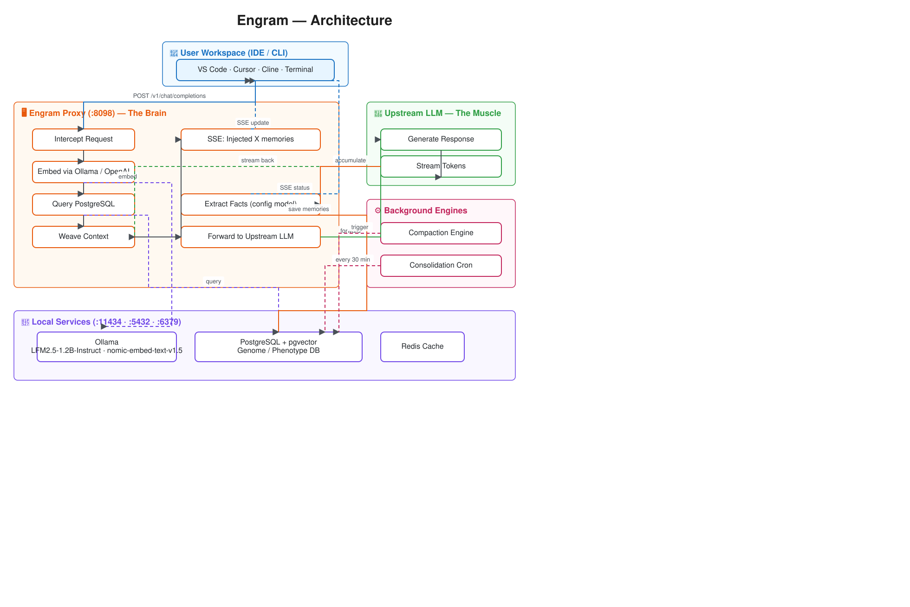
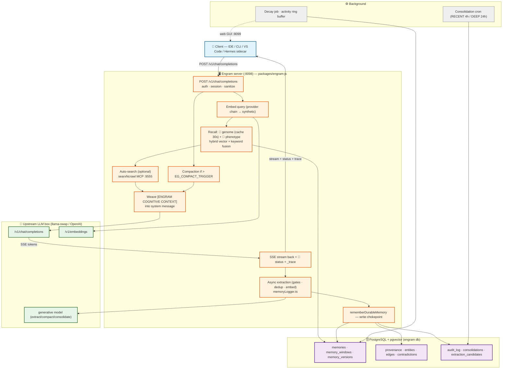

# Engram — Persistent Memory for AI Agents

A **cognitive memory proxy** that gives LLMs persistent, project-aware context across sessions. It sits between a client (IDE, CLI, VS Code chat, or another agent like Hermes) and any upstream LLM, silently giving that LLM **durable memory**: it intercepts OpenAI-compatible chat requests, embeds the user's prompt, recalls relevant memories from a **PostgreSQL + pgvector** store, injects them into the system prompt, forwards the enriched request to the upstream model, streams the response back, and — in the background — extracts new durable facts from the conversation for future recall.

> 🧠 *Your AI assistant remembers everything — without bloating context windows.*

[]()
[]()
[](https://www.postgresql.org/)
[]()

---

## Table of Contents

- [What Engram Is](#what-engram-is)
- [How It Works](#how-it-works)
- [Memory Model: Genome & Phenotype](#memory-model-genome--phenotype)
- [Architecture](#architecture)
- [Project Structure](#project-structure)
- [Quick Start (Docker)](#quick-start-docker)
- [Client Configuration](#client-configuration)
- [Configuration](#configuration)
- [Local Development (No Docker)](#local-development-no-docker)
- [Web GUI](#web-gui)
- [API Overview](#api-overview)
- [Troubleshooting](#troubleshooting)

---

## What Engram Is

Engram is a hand-rolled Node.js/TypeScript HTTP server — no Express/Fastify — that acts as an intelligent proxy between clients and an LLM. It is biologically inspired (genome/phenotype memory model, Ebbinghaus decay, a "hippocampus" consolidation cron) and built around five capabilities:

1. **Memory recall & injection** — every request is embedded, vector-searched against a PostgreSQL + pgvector store, and enriched with a `[ENGRAM COGNITIVE CONTEXT]` block before being forwarded upstream.
2. **Generative extraction** — after each conversation, a configurable generative model extracts new durable facts from the transcript and stores them (with quality gates, dedup, and embedding).
3. **Compaction engine** — long conversations are summarized in-place so context windows never grow unbounded.
4. **Consolidation cron ("the hippocampus")** — a two-tier background job that merges, promotes, and prunes memories to keep the knowledge base healthy.
5. **Memory decay** — temporal salience with access-based reinforcement and exponential decay.

It can run in **two deployment modes**:

- **Standalone smart proxy** — clients point at `http://<host>:8098/v1/chat/completions`; Engram embeds/recalls/weaves/forwards/streams and does all orchestration itself.
- **Hermes sidecar (Option B)** — Engram is *not* the chat proxy. Hermes talks to its own LLM; Engram is a memory + cognition engine reached over HTTP: `prefetch()` injects genome + recalled phenotype into each turn, `sync_turn()` ingests each completed turn. See [Client Configuration](#client-configuration).

Engram is fully **model- and provider-agnostic**: embeddings, generative extraction, and the upstream chat model are all resolved through env-driven cascading chains (see [Configuration](#configuration)). In the live deployment a single LAN llama-swap box serves all three roles.

---

## How It Works

### Request lifecycle (`POST /v1/chat/completions`)

The heart of Engram is the chat-completions route in `packages/engram-js/src/api/routes/chat/completions/route.ts`. The full flow:

1. **Authenticate & validate** — `x-api-key` / Bearer / `ApiKey` header (public endpoints are only `/health`, `/api/performance/system`, `/api/performance/llama-swap`). An authenticated `user_id` overrides any client-supplied one (impersonation guard). The session id resolves from `x-session-id` header → body → query → a deterministic `sha256(user_id:project_id)` (so all turns of one conversation group automatically).
2. **Embed the query** — the last user message is embedded via the per-facet provider chain: primary provider → fallback providers in order → deterministic *synthetic hashing embedding* (feature-hashed tokens + n-grams), so embedding never hard-fails.
3. **Recall memories** —
   - 🧬 **Genome** (core directives): fetched with a direct SQL query, cached in-memory for 30s (`genomeCache`), always injected.
   - 🔬 **Phenotype** (context): hybrid recall — pgvector cosine search fused with a `pg_trgm` keyword search, re-ranked by an evidence-fusion score (`P = 1 − (1−p_vec)(1−p_lex)`), scaled by importance and penalized for open contradictions. Top 5 results are mapped to `{id, content, sector, score}`.
4. **Auto-search (optional)** — if enabled (`EG_AUTO_SEARCH_ENABLED`) and the top recall score is below the confidence threshold (`EG_AUTO_SEARCH_MIN_CONFIDENCE`, 40%) for a tech-style prompt, Engram queries SearXNG via the searxNcrawl MCP server and weaves a `--- WEB CONTEXT (auto-retrieved) ---` block into the prompt.
5. **Weave the context block** — `buildCognitiveContext()` produces the `[ENGRAM COGNITIVE CONTEXT]` block: genome bullets, phenotype grouped by sector, then web results — closed with an instruction to use the context silently. Prior history is sanitized (Engram status artifacts and `reasoning_content` thinking tokens stripped) before injection.
6. **Compact if needed** — when the sanitized message count exceeds `EG_COMPACT_TRIGGER` (code default 50, `.env.example` 100), the compaction engine runs before forwarding (see below).
7. **Forward upstream** — the enriched payload goes to `EG_UPSTREAM_LLM_URL` (`/chat/completions`) via a retrying fetch with a per-host circuit breaker; llama-swap requests are serialized per model through a promise-chain lock. All original fields (tools, temperature, …) pass through.
8. **Stream back via SSE** — tokens pipe transparently to the client; Engram's status arrives as *valid OpenAI-format* `chat.completion.chunk` deltas, so any OpenAI-compatible client renders it natively: `🧠 Injected 🧬 N genome, 🧠 M memories, 📦 K facts, 🌐 S sources`, then a final `_trace` payload (the "Engram Memory Trace" shown by the VS Code extension) and `data: [DONE]`.
9. **Extract in the background** — `logInteractionAsync()` is fire-and-forget: it never blocks the stream.

### Memory extraction & storage

After each turn, the generative model (`EG_MODEL_GENERATIVE` via `EG_GENERATIVE_URL`) analyzes the conversation:

- **Cooldown gate** — skips if an extraction ran within `EG_EXTRACTION_COOLDOWN_MS` (30s) or the response is under 50 chars.
- **Prompt hygiene** — the full extraction directive (including the entire DO-NOT-EXTRACT list: IDE-save diffs, session state, build results, secrets, vague boilerplate) goes in the *system* role; only truncated user prompt (2500 chars) + response (3000 chars) go in the *user* role.
- **Quality gate** — `isWorthRemembering()` enforces a hard floor (15–400 chars) and regex-rejects leaked secrets, ephemeral session state, boilerplate, and self-referential memory meta — the last line of defense that keeps the store clean.
- **Dedup** — exact-content check plus a normalized substring near-duplicate check against active rows.
- **Storage** — every write funnels through the single transaction chokepoint `rememberDurableMemory()` (`src/durable/repository.ts`), which classifies genome vs phenotype, infers a sector, scores importance, applies bitemporal timestamps, embeds the content, writes version 1 + provenance + audit log, and (for long memories) windowed embeddings.

### Compaction engine

When a conversation exceeds `EG_COMPACT_TRIGGER` messages, the compaction engine keeps context bounded (invoked in the request path, before forwarding):

1. **Isolate** — split into old history + a recent raw tail (`EG_MAX_RAW_TURNS`, code default 6, `.env.example` 4); tool-call boundaries are fixed so no orphan tool results break the upstream API; the last user message is preserved for continuity.
2. **Thin** — truncate oversized tool outputs (>800 chars), assistant responses (>1200), and user messages (>1000); drop consecutive duplicate tool calls.
3. **Summarize & extract in one LLM call** — the compacted history goes to the generative model, which returns JSON `{summary, facts[]}` (temperature 0.1, capped at `EG_COMPACT_PROMPT_MAX_CHARS`).
4. **Save facts** — extracted facts are stored via `rememberDurableMemory` with `source: "compaction_engine"` (one failed save rolls back the batch).
5. **Reconstruct** — old history is replaced with `[COMPACTED SESSION SUMMARY]` plus the raw tail. If the LLM call fails, old history is dropped silently and only the raw tail survives — context never grows. A cooldown (`EG_COMPACTION_COOLDOWN_MS`, default 10s) prevents hot-looping.

### Consolidation engine ("the hippocampus")

A background cron (started 2s after boot) with **two env-overridable tiers**:

| Tier       | Interval                                   | Window                            | Min group | Purpose                                                |
| ---------- | ------------------------------------------ | --------------------------------- | --------- | ------------------------------------------------------ |
| **RECENT** | `EG_CONSOLIDATION_RECENT_INTERVAL_MS` (4h) | last `…_RECENT_MAX_AGE_DAYS` (7d) | 2         | Promote standing rules / catch near-dupes within hours |
| **DEEP**   | `EG_CONSOLIDATION_DEEP_INTERVAL_MS` (24h)  | up to `…_DEEP_MAX_AGE_DAYS` (30d) | 3         | Long-window cleanup (requires `access_count >= 1`)     |

Each cycle groups non-archived memories by `consolidation_hash` (max 15 groups), sends each group to the generative model, and applies the returned `merge | update | promote | delete` actions in **one transaction** — any error rolls back the whole batch. If the LLM omits `new_content` for a merge/update, a synthesis model (`EG_MODEL_GENERATIVE_FALLBACK`) generates it. Manual trigger: `POST /api/dashboard/consolidate`.

### Memory decay engine

Temporal salience with access-based reinforcement and exponential decay:

- **Base decay rate**: 1% per day (`DEFAULT_DECAY_CONFIG.baseRate`, configurable)
- **Genome multiplier**: genome memories decay at 30% the phenotype rate (`genomeMultiplier: 0.3`)
- **Access reinforcement**: each access reduces effective age by 7 days (`accessReinforcementDays: 7`)
- **Per-sector rates at extraction**: episodic 0.15, semantic/procedural 0.05, genome 0.03, default phenotype 0.1
- Salience decays exponentially and feeds `memory_tier` transitions (active/warm/cold/archived). The decay job runs via `POST /admin/decay/run`.

---

## Memory Model: Genome & Phenotype

| Layer            | Behavior                           | Description                                                                                                                                                                                       |
| ---------------- | ---------------------------------- | ------------------------------------------------------------------------------------------------------------------------------------------------------------------------------------------------- |
| 🧬 **Genome**    | Immutable, near-never-decaying     | Core directives — foundational facts *always* injected into every request (e.g. *"User prefers TypeScript"*). Stored as `is_genome = true`, cached 30s, retrieved by direct SQL (not similarity). |
| 🔬 **Phenotype** | Decaying context via vector search | Context retrieved by similarity across 5 sectors, with per-sector decay rates.                                                                                                                    |

Genome classification is **deliberately opt-in**: `classifyAsGenome()` matches explicit `GENOME_PATTERNS` (capitals/definitions/scientific constants/mathematical identities/precisely-anchored historical dates) or an explicit `is_genome` flag at write time. The old heuristic that promoted *any* short declarative sentence to genome was removed — it flooded the genome tier with ephemeral facts.

### Phenotype Sectors

Sector is inferred from content keywords, then **coerced through `normalizeSector`** — a closed 5-value enum enforced at the DB boundary, so an LLM can never persist an invented sector like `"important decision"`.

| Sector          | Type                             | Example                                                                   |
| --------------- | -------------------------------- | ------------------------------------------------------------------------- |
| 📖 `semantic`   | Facts & domain knowledge         | *"PostgreSQL uses pgvector for embeddings"*                               |
| ⚙️ `procedural`  | Code patterns & workflows        | *"Auth middleware validates JWT tokens before route handlers"*            |
| 🎬 `episodic`   | Events & specific interactions   | *"User debugged the Docker compose setup on March 15"*                    |
| 💭 `emotional`  | Preferences, tone, sentiment     | *"User prefers concise, no-nonsense explanations"*                        |
| 🔍 `reflective` | Meta-cognition & lessons learned | *"When debugging Docker networking, always check subnet conflicts first"* |

---

## Architecture

<p align="center">
  
</p>

> 📐 **Editable source:** [`docs/assets/architecture.excalidraw`](docs/assets/architecture.excalidraw) — drag it onto [excalidraw.com](https://excalidraw.com) (or open with the Excalidraw VS Code extension) to edit. The Mermaid source below is kept for reference.


```mermaid
flowchart TD
    classDef user fill:#e1f5fe,stroke:#01579b,stroke-width:2px
    classDef engram fill:#fff3e0,stroke:#e65100,stroke-width:2px
    classDef db fill:#f3e5f5,stroke:#4a148c,stroke-width:2px
    classDef up fill:#e8f5e9,stroke:#1b5e20,stroke-width:2px
    classDef bg fill:#f0f0f0,stroke:#666,stroke-width:1px

    U["👤 Client — IDE / CLI / VS Code / Hermes sidecar"]:::user

    subgraph ENGRAM["🖥️ Engram server (:8098) — packages/engram-js"]
        E1["POST /v1/chat/completions<br/>auth · session · sanitize"]:::engram
        E2["Embed query (provider chain → synthetic)"]:::engram
        E3["Recall: 🧬 genome (cache 30s) + 🔬 phenotype<br/>hybrid vector + keyword fusion"]:::engram
        E4["Auto-search (optional)<br/>searxNcrawl MCP :9555"]:::engram
        E5["Weave [ENGRAM COGNITIVE CONTEXT]<br/>into system message"]:::engram
        E6["Compaction if > EG_COMPACT_TRIGGER"]:::engram
        E7["SSE stream back + 🧠 status + _trace"]:::engram
        E8["Async extraction (gates · dedup · embed)<br/>memoryLogger.ts"]:::engram
        E9["rememberDurableMemory — write chokepoint"]:::engram
    end

    subgraph DB["🗄️ PostgreSQL + pgvector (engram db)"]
        T1["memories · memory_windows · memory_versions"]:::db
        T2["provenance · entities · edges · contradictions"]:::db
        T3["audit_log · consolidations · extraction_candidates"]:::db
    end

    subgraph UP["🚀 Upstream LLM box (llama-swap / OpenAI)"]
        U1["/v1/chat/completions"]:::up
        U2["/v1/embeddings"]:::up
        U3["generative model (extract/compact/consolidate)"]:::up
    end

    subgraph BG["⚙️ Background"]
        B1["Consolidation cron (RECENT 4h / DEEP 24h)"]:::bg
        B2["Decay job · activity ring buffer"]:::bg
    end

    U -->|"POST /v1/chat/completions"| E1
    E1 --> E2 --> U2
    E2 --> E3 --> T1
    E3 --> E4 --> E5
    E1 --> E6 --> E5
    E5 --> U1
    U1 -->|"SSE tokens"| E7 -->|"stream + status + trace"| U
    E7 --> E8 --> U3
    E8 --> E9 --> T1
    E9 --> T2
    E9 --> T3
    B1 --> T3
    B2 --> T1
    B2 -.->|"web GUI :8099"| U
```

---

## Project Structure

The repo is an npm-workspaces monorepo (root `package.json` workspaces: `packages/engram-js` + `apps/web`; root scripts `dev`/`build`/`start`/`test` mirrored by the `Makefile`):

```
Engram/
├── packages/
│   └── engram-js/              # The Engram server (TypeScript, tsc → dist/, runs `npm start`)
│       └── src/
│           ├── api/            # Hand-rolled HTTP app + middleware + routes
│           │   └── routes/     #   chat/completions (the proxy), recall, memories/*, ingest/*,
│           │                   #   dashboard/*, ide/*, consolidations, contradictions, admin, stats, sources
│           ├── durable/        # schema.ts (15 tables, idempotent SQL), repository.ts (write/read
│           │                   #   chokepoints), scoring.ts (hybrid recall scoring)
│           ├── embeddings/     # embed.ts (6 providers + synthetic fallback), facets.ts (per-sector config)
│           ├── services/       # memoryInjector, memoryLogger, compactionEngine, consolidationEngine,
│           │                   #   hybridSearch, autoSearch, windowedEmbedder, importanceCalculator, ...
│           ├── database/       # connection (pg pool), migrate.ts (idempotent boot migrations), models.ts
│           ├── configuration/  # env loading + parsing (envFile.ts, index.ts)
│           └── mcp/            # MCP server/client surface (engram_store, engram_search, ...)
├── apps/
│   ├── web/                    # Web GUI — React 18 + Vite + Tailwind SPA (host port 8099, nginx proxy
│   │                           #   target; proxies /api/ → engram:8080 with SSE-friendly buffering off)
│   ├── vscode-extension/       # "Engram for VS Code" — separate repo (engram-vscode, publisher
│   │                           #   Nullure); @cortex chat participant, auto-links cursor/claude/windsurf
│   │                           #   configs, IDE session tracking, Memory Trace rendering
│   ├── searxNcrawl/            # Auto-search service (git submodule) — Python FastMCP server on :9555
│   │                           #   exposing crawl / crawl_site / search; SearXNG sidecar config
│   └── hermes-plugin/          # Hermes memory-provider plugin ("Option B" sidecar; stdlib urllib only)
├── docs/                       # plan.md, Vision.md, compaction.engine.md, model-breakdowns.md, rebrand.md, ...
├── scripts/                    # backfill_embeddings.py, store-hygiene purge scripts (DRY-RUN by default)
├── docker/                     # postgres init scripts (databases, vector/halfvec extensions)
├── docker-compose.yml          # postgres · redis · engram · searxng · searxncrawl · web
└── bin/opm.js                  # `engram` CLI (watch → /api/dashboard/activity, memory CRUD)
```

**Notable subsystems:** `src/sources/*` (GitHub/Drive/Notion/OneDrive/crawler connectors), `src/ingestion/*` (document chunking/extraction), `src/vectorStores/*` (adapters for qdrant/pinecone/weaviate/chroma/milvus/valkey — the default deployment stays on Postgres), `src/durable/localstore.ts` (SQLite fallback via `EG_STORAGE=sqlite`).

---

## Quick Start (Docker)

```bash
# Build and start everything
docker compose up --build -d

# Check status
docker compose ps

# View logs
docker compose logs -f engram
```

### Services

| Service         | Host port   | Description                                                                       |
| --------------- | ----------- | --------------------------------------------------------------------------------- |
| **postgres**    | 5432        | PostgreSQL 16 + pgvector (`pgvector/pgvector:0.8.2-pg16-trixie`) — memory storage |
| **redis**       | 6379        | Redis 7 cache                                                                     |
| **engram**      | 8098 → 8080 | The Engram server — main API endpoint (healthcheck on `/health`)                  |
| **searxng**     | 8888        | SearXNG metasearch (for auto-search; `cap_drop: ALL`)                             |
| **searxncrawl** | 9555        | Auto-search FastMCP server (crawl/search tools)                                   |
| **web**         | 8099        | Engram Web GUI — nginx serving the React SPA, proxying `/api/` → `engram:8080`    |

All services share the `ftr10-engram` bridge network; named volumes `postgres_data`, `redis_data`, `server_data` persist data. There is **no bundled Ollama service** — Engram expects models to be reachable via env-configured URLs (in the live deployment a LAN llama-swap box serves embeddings, the generative model, and the upstream chat model; see [Configuration](#configuration)).

> **Observability:** Langfuse was removed from the stack (its SDK remains a dormant dependency, gated by `EG_LANGFUSE_ENABLED`, default off). The built-in **Engram Web GUI** (port 8099) is the primary dashboard — live server logs, memory activity, recall, and performance metrics.

### Stop & Clean

```bash
# Stop all services
docker compose down

# Stop and remove all data volumes (fresh start)
docker compose down -v
```

---

## Client Configuration

Point your IDE or CLI tool at the Engram proxy (OpenAI-compatible):

```
http://<your-server-ip>:8098/v1
```

The proxy forwards enriched requests to the upstream LLM configured via `EG_UPSTREAM_LLM_URL`. Engram's SSE status messages are valid OpenAI-format deltas, so any OpenAI-compatible client (Cline, custom CLI, SDK) renders them natively.

### Engram for VS Code (`apps/vscode-extension`)

The extension activates on startup, connects to `http://localhost:8098` (configurable `engram.backend_url`), and:

- **Auto-links** cursor/claude/windsurf/copilot/codex client configs to point at the Engram proxy
- Runs an **ActivityObserver** polling `/api/dashboard/activity` for live traffic in the status bar / Dashboard panel
- Tracks IDE sessions (`/api/ide/session/start|end`, `/api/ide/events`) and exposes `engram.queryContext` / `engram.addToMemory`
- Registers the `@cortex` **chat participant**, which forwards prompts through Engram and renders the collapsible "🧠 Engram Memory Trace" from the `_trace` SSE payload

### Hermes sidecar (Option B)

When wired into [Hermes Agent](https://github.com/NousResearch/Hermes) as a native memory-provider plugin, Engram is **not** the chat proxy — Hermes talks to its own LLM and Engram is a sidecar memory + cognition engine:

- **Before each turn** → `prefetch()` injects cached genome directives + phenotype recall (`POST /recall`) into the turn as a `<memory-context>` block.
- **After each turn** → `sync_turn()` hands the full turn to `POST /ingest/conversation` so Engram's extraction LLM decides what to store (genome promotion is explicitly disabled for chat turns — genome is reserved for explicit `engram_remember(genome: true)`).
- Engram's chat proxy, compaction, and auto-search are **not** used in this mode; consolidation / decay / contradiction are exposed as `engram_consolidate` / `engram_decay` / `engram_contradiction` tools.
- The plugin lives at `apps/hermes-plugin/` (copied to `~/.hermes/plugins/engram/`); activate with `hermes config set memory.provider engram`. No MCP server — stdlib `urllib` only.

---

## Configuration

Copy `.env.example` to `.env` and adjust. Engram loads `.env` from the cwd and up to four ancestor directories **without overriding already-set process env** (in Docker, the compose `environment:` block beats `env_file:` — a `docker compose restart` won't re-read a changed `.env`; use `docker compose up -d`).

Key variables (see `.env.example` for the full catalog):

| Variable                                                                   | Default                                              | Role                                                                                                    |
| -------------------------------------------------------------------------- | ---------------------------------------------------- | ------------------------------------------------------------------------------------------------------- |
| `EG_PORT`                                                                  | `8080`                                               | Listen port (8098 host-side in Docker)                                                                  |
| `EG_STORAGE`                                                               | `postgres`                                           | Backend (`postgres` / `sqlite`)                                                                         |
| `EG_PG_HOST` / `EG_PG_PORT` / `EG_PG_DB` / `EG_PG_USER` / `EG_PG_PASSWORD` | localhost / 5432 / engram / postgres / —             | PostgreSQL connection                                                                                   |
| `EG_VEC_DIM`                                                               | `1536` (768 in .env.example & deployment)            | Embedding dimension — must match the model and the `halfvec` column                                     |
| `EG_EMBEDDINGS`                                                            | `openai`                                             | Primary embedding provider (`openai` / `gemini` / `aws` / `siray` / `local` / `synthetic`)              |
| `EG_MODEL_EMBEDDING`                                                       | `qwen3-embedding:0.6b`                               | Universal default embedding model (`env.embed_model_primary`)                                           |
| `EG_EMBED_MODEL`                                                           | —                                                    | **Global embedding override** — read by `resolveEmbeddingModel()` before the config table               |
| `EG_MODEL_EMBED_<FACET>`                                                   | —                                                    | Per-facet default embedding models (semantic/episodic/procedural/emotional/reflective)                  |
| `EG_<PROVIDER>_MODEL` / `EG_<PROVIDER>_<FACET>_MODEL`                      | —                                                    | Provider-wide / per-provider+per-facet overrides (e.g. `EG_OPENAI_MODEL`, `EG_OPENAI_PROCEDURAL_MODEL`) |
| `EG_MODEL_EMBEDDING_FALLBACK`                                              | `bge-m3`                                             | Comma-separated fallback embedding *provider* chain                                                     |
| `EG_GENERATIVE_URL` / `EG_MODEL_GENERATIVE`                                | — / `qwen3.5:2b`                                     | Generative model endpoint + name (extraction, compaction, consolidation, auto-search queries)           |
| `EG_MODEL_GENERATIVE_FALLBACK`                                             | `qwen2.5:3b`                                         | Synthesis fallback for consolidation                                                                    |
| `EG_UPSTREAM_LLM_URL`                                                      | —                                                    | Where the proxy forwards chat completions                                                               |
| `EG_COMPACT_TRIGGER` / `EG_MAX_RAW_TURNS`                                  | `50` / `6` (code); `100` / `4` (.env.example)        | Compaction thresholds                                                                                   |
| `EG_COMPACT_PROMPT_MAX_CHARS` / `EG_COMPACTION_COOLDOWN_MS`                | `4096` / `10s` (code); `800` / `120s` (.env.example) | Compaction prompt cap / hot-loop guard                                                                  |
| `EG_EXTRACTION_COOLDOWN_MS` / `EG_MAX_FACTS_PER_TURN`                      | `30000` / `5` (code); `8` (.env.example)             | Extraction throttle / per-turn fact cap                                                                 |
| `EG_CONSOLIDATION_RECENT_*` / `EG_CONSOLIDATION_DEEP_*`                    | 4h·7d·2 / 24h·30d·3                                  | Two-tier consolidation scheduling                                                                       |
| `EG_HYBRID_SEARCH`                                                         | `true`                                               | Toggle hybrid vector + keyword recall fusion                                                            |
| `EG_AUTO_SEARCH_ENABLED` + `EG_AUTO_SEARCH_*`                              | `false`                                              | searxNcrawl web augmentation (min confidence 40%)                                                       |
| `EG_API_KEY` / `EG_REQUIRE_API_KEY` / `EG_INTERNAL_API_KEY`                | —                                                    | Auth                                                                                                    |
| `EG_VECTOR_STORE`                                                          | `postgres`                                           | Vector backend (postgres, or qdrant/pinecone/weaviate/chroma/milvus/valkey)                             |
| `EG_TELEMETRY`                                                             | `true`                                               | Boot telemetry                                                                                          |

### Model resolution

All models are env-configurable — nothing is hardcoded at runtime.

**Embedding models** — `resolveEmbeddingModel(facet, provider)` (`src/database/models.ts`) tries, in order:

1. Per-facet + per-provider override: `EG_<PROVIDER>_<FACET>_MODEL`
2. Provider-wide override: `EG_<PROVIDER>_MODEL`
3. Global override: `EG_EMBED_MODEL`
4. Config table built from `EG_MODEL_EMBED_<FACET>` → `PROVIDER_DEFAULTS` (openai → `text-embedding-3-small`, gemini → `models/gemini-embedding-001`, aws → `amazon.titan-embed-text-v2:0`) → `env.embed_model_primary`
5. Final fallback: facet → semantic → openai → `env.embed_model_primary`

**Provider fallback** — at runtime, `get_sem_emb()` tries `[EG_EMBEDDINGS, ...EG_MODEL_EMBEDDING_FALLBACK]` in order; if *all* providers fail it uses a deterministic **synthetic hashing embedding** (feature-hashed tokens + n-grams, L2-normalized to `EG_VEC_DIM`), so writes never hard-fail on embedding.

**Generative models** — one model (`env.generative_model`) serves extraction, compaction, consolidation, and auto-search query generation (with `/no_think` forced to keep thinking off); `env.fallback_model` is used only for consolidation synthesis.

**Live deployment** (compose + `.env`): `EG_EMBEDDINGS=openai` → `EG_OPENAI_BASE_URL=${REMOTE_LLM_URL}/v1`, `EG_OPENAI_MODEL=Nomic-Embed-Text-v1.5` (768-dim), `EG_GENERATIVE_MODEL=Gemma-4-12B-no-thinking`, `EG_UPSTREAM_LLM_URL=${REMOTE_LLM_URL}/v1` — one llama-swap box on the LAN serves embeddings, generative extraction, and the upstream chat model.

---

## Local Development (No Docker)

```bash
# 1. Start PostgreSQL locally and create the database
sudo systemctl start postgresql
psql -U postgres -c "CREATE DATABASE engram;"

# 2. Install dependencies (npm workspaces)
npm install

# 3. Copy env and set the essentials (embeddings + generative + upstream model endpoints)
cp .env.example .env
#    edit .env: EG_PG_PASSWORD, EG_GENERATIVE_URL, EG_MODEL_GENERATIVE, EG_UPSTREAM_LLM_URL

# 4. Start the server (migrations run automatically at boot)
cd packages/engram-js && EG_PORT=8080 npx nodemon src/server.ts

# 5. Or run the compiled build
npm run build && npm start
```

Migrations are **idempotent** — the same `IF NOT EXISTS` statement list (`src/durable/schema.ts`, version `4.0.0-advanced-features`) executes in one transaction at every boot, so the schema is always current before the API accepts traffic.

---

## Web GUI

The web interface (React/Vite SPA on port 8099) is the primary dashboard:

- **Dashboard** — memory counts, genome/phenotype breakdown, sector/tier statistics, manual consolidation trigger
- **Memory Explorer** — search, filter by sector, edit, and delete stored memories; each row shows sector, genome/phenotype type, and an **importance tier pill + score** (critical/high/medium/low from the v4.0.0 schema)
- **Server Logs** — live auto-refreshing Pino logs
- **Performance Monitor** — CPU, memory, disk, and llama-swap metrics
- **Memory Recall** — test the real recall engine (`POST /api/dashboard/recall`)
- **Activity** — live memory read/write traffic (`/api/dashboard/activity`)

```bash
# Dev mode (Vite + React, proxies /api → http://localhost:8080)
cd apps/web && npm run dev

# Production build
cd apps/web && npm run build
```

---

## API Overview

The server exposes two families: **root-level API routes** (used by clients and the Hermes plugin) and **dashboard routes** (used by the Web GUI; nginx only forwards `/api/` to the container, which is why recall is duplicated under `/api/dashboard/recall`).

| Endpoint                                                                                                                     | Method               | Description                                                             |
| ---------------------------------------------------------------------------------------------------------------------------- | -------------------- | ----------------------------------------------------------------------- |
| `/v1/chat/completions`                                                                                                       | POST                 | OpenAI-compatible chat endpoint with memory injection (the proxy)       |
| `/health`                                                                                                                    | GET                  | Health check                                                            |
| `/recall`                                                                                                                    | POST                 | Memory recall/search (embed query → hybrid recall)                      |
| `/memories`                                                                                                                  | GET/POST             | List / create memories                                                  |
| `/memories/:id`                                                                                                              | GET / PATCH / DELETE | Read / update / delete a memory                                         |
| `/memories/:id/explain`                                                                                                      | GET                  | Explain why a memory was recalled                                       |
| `/memories/:id/reinforce`                                                                                                    | POST                 | Reinforce a memory (boosts salience)                                    |
| `/memories/:id/tier`                                                                                                         | POST                 | Change memory tier (active/warm/cold/archived)                          |
| `/contradictions`                                                                                                            | POST                 | Create a contradiction between memories                                 |
| `/contradictions/:id/resolve`                                                                                                | POST                 | Resolve a contradiction                                                 |
| `/consolidations` / `/consolidations/claim` / `/consolidations/:id/complete`                                                 | POST                 | Consolidation lifecycle endpoints                                       |
| `/edges/execute`                                                                                                             | POST                 | Execute knowledge-graph edge operations                                 |
| `/graph/temporal/query`                                                                                                      | POST                 | Temporal graph query for memory relationships                           |
| `/ingest/conversation`                                                                                                       | POST                 | Ingest a full conversation turn (Hermes sidecar)                        |
| `/ingest/document` / `/ingest/event` / `/ingest`                                                                             | POST                 | Document / event ingestion                                              |
| `/ingest/candidates/:id/accept` / `/reject`                                                                                  | POST                 | Promote / reject extraction candidates                                  |
| `/sources/:source/ingest`                                                                                                    | POST                 | Ingest from external sources (github, notion, googleDrive, onedrive, …) |
| `/admin/decay/run`                                                                                                           | POST                 | Run the memory decay engine manually                                    |
| `/stats/summary` / `/stats/timeseries`                                                                                       | GET                  | Memory statistics                                                       |
| `/api/dashboard/stats`                                                                                                       | GET                  | Dashboard statistics (genome/phenotype breakdown)                       |
| `/api/dashboard/memories`                                                                                                    | GET                  | List memories (paginated, searchable, sector filter)                    |
| `/api/dashboard/memories/:id`                                                                                                | PUT/DELETE           | Update / delete a memory                                                |
| `/api/dashboard/logs` / `/api/dashboard/log`                                                                                 | GET                  | Interaction logs / full Pino log file                                   |
| `/api/dashboard/recall`                                                                                                      | POST                 | Recall engine (browser-reachable duplicate of `/recall`)                |
| `/api/dashboard/consolidate`                                                                                                 | POST                 | Trigger consolidation manually                                          |
| `/api/dashboard/perf`                                                                                                        | GET                  | Server performance metrics                                              |
| `/api/dashboard/activity`                                                                                                    | GET                  | Live memory activity feed (ring buffer)                                 |
| `/api/dashboard/activity/clear`                                                                                              | POST                 | Clear the activity feed                                                 |
| `/api/performance/system`                                                                                                    | GET                  | System metrics (CPU, memory, disk, load, uptime)                        |
| `/api/performance/llama-swap`                                                                                                | GET                  | Upstream llama-swap box metrics                                         |
| `/api/ide/session/start` · `/api/ide/session/end` · `/api/ide/events` · `/api/ide/context` · `/api/ide/patterns/:session_id` | GET/POST             | VS Code extension integration endpoints                                 |

---

## Troubleshooting

<details>
<summary><strong>Common issues</strong></summary>

### Server won't start

Verify PostgreSQL is running and port 8098 is free (`lsof -i :8098`). Check logs: `docker compose logs engram`. Migrations run automatically at boot — they require the `engram` database to exist (`docker/postgres/init/01-create-databases.sql` creates it on first compose up).

### Recall returns flat / low scores

Rows with NULL embeddings are invisible to the HNSW vector index (it's partial `where embedding is not null`). If extraction wrote rows without embeddings, recall degrades to flat ~0.34 scores. Fix the embedding pipeline, then backfill with `scripts/backfill_embeddings.py`.

### Cannot reach upstream LLM

Confirm `EG_UPSTREAM_LLM_URL` points to your GPU machine or provider endpoint, and that the embedding + generative URLs (`EG_OPENAI_BASE_URL`, `EG_GENERATIVE_URL`) also resolve. Test with a direct curl request. Note llama-swap must have the embedding model loaded with an embedding-capable router — chat-only model lists 404 on `/embeddings`.

### Compaction not triggering

Compaction runs when a conversation exceeds `EG_COMPACT_TRIGGER` (code default 50, `.env.example` 100). Check server logs for the `compactionEngine` module.

### Consolidation not running

The cron has two tiers (RECENT 4h / DEEP 24h). Trigger manually via `POST /api/dashboard/consolidate`. Groups come from `consolidation_hash` with tier-specific minimum sizes (2 recent / 3 deep).

### `.env` changes not picked up after `docker compose restart`

Compose's `environment:` block overrides `env_file:`, and `restart` doesn't re-read `.env`. Use `docker compose up -d` (or `docker compose up --build -d` after changing the server code) — the container runs a compiled `dist/` bundle, so source changes require a rebuild.

</details>

---

## Naming

The project was previously called **OpenMemory** and **CodeCortex**. The official name is **FTR10 Engram**:

- **Engram** — Server / core package (`packages/engram-js`)
- **Engram Web GUI** — Dashboard interface (`apps/web`)
- **EngramVS** — VS Code extension (`apps/vscode-extension`)
